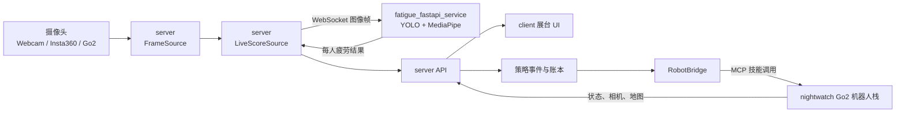

# NightWatch 目录与文件职责说明

> 范围：仅说明 `/Users/yeye/Projects/AdventureX/RobotDog/NightWatch/`。
> 基准：2026-07-25，`agent/robot-handoff` 分支。
> 目标：说明每个目录和关键文件“负责什么、控制什么、被谁调用、修改后会影响哪里”。

## 1. 先理解整个项目

NightWatch 不是单一程序，而是把以下几套系统放在同一个仓库中：

| 层 | 主要目录 | 职责 |
| --- | --- | --- |
| 展示层 | `client/` | 展台网页、疲劳分数、摄像头、问卷、事件时间线、三维雷达地图 |
| 业务与编排层 | `server/` | 统一 API、视频源、疲劳结果转发、问卷数据库、事件账本、机器人触发策略 |
| 疲劳感知层 | `fatigue_fastapi_service/`、`common/`、`02_yolov8face_mediapipe/` | YOLO 找脸、MediaPipe 找关键点、计算 EAR/MAR/PERCLOS、头姿和视线，输出疲劳结果 |
| 机器人层 | `nightwatch/` | Unitree Go2 的巡逻、探索、地图、跟随、干预、护送、语音、MCP 工具和操作台 |
| 外部相机层 | `insta360_bridge/` | 在 Windows 上读取 Insta360，相机拼接/解码后输出 MJPEG |
| 规划与交付 | `PRD.md`、`prds/` 等 | 产品要求、技术设计、阶段任务、现场运营和提交材料 |

### 1.1 核心数据流

### 1.2 四条最重要的控制链

1. **疲劳识别链**
   `server/app/services/frame_source.py` 取图 → `server/app/services/live_scorer.py` 发图 → `fatigue_fastapi_service/app/analyzer.py` 推理 → `common/metrics.py` 做时序判断。

2. **机器人干预链**
   `server/app/services/robot_bridge.py` 检查持续疲劳证据 → 调用 `nightwatch/nightwatch/intervene.py` → 证据继续满足时调用 `nightwatch/nightwatch/escort.py`。

3. **地图展示链**
   `nightwatch/nightwatch/map_stream.py` 输出点云和位姿 → `server/app/routers/lidar.py` 中继 → `client/components/lidar/` 解析并渲染。

4. **访客问卷链**
   `client/app/form/` 展示问卷 → `server/app/routers/form.py` 定义问题和接口 → `server/app/services/intake_db.py` 写入 SQLite → `client/components/IntakeQueue.tsx` 展示待护送访客 → `RobotBridge` 发起护送。

---

## 2. 根目录文件

### `.gitignore`

定义不应提交到 Git 的内容，主要包括：

- Python 虚拟环境、缓存、构建产物；
- Node.js 的 `node_modules/`、Next.js 的 `.next/`；
- `.env`、`robot.env` 等本地密钥和设备配置；
- SQLite 数据库、日志、地图和模型运行产物；
- 本地 DimensionalOS 仓库 `dimos/`；
- Insta360 私有 SDK 和编译目录。

它控制的是**版本库边界**，不控制程序运行逻辑。修改时要特别小心，错误删除忽略规则可能把密钥、数据库、私有 SDK 或大型模型提交到远程。

### `README.md`

项目总览和启动说明，包含：

- Night Watch 的产品介绍；
- 疲劳检测、机器人、展台 UI 和账本的整体关系；
- 三个主要服务的启动方式；
- API 契约；
- Go2 集成模式。

它是面向开发者和评审的入口说明，不直接参与运行。

### `PRD.md`

当前产品需求的总规范，定义：

- “好奇探索是默认状态”；
- 三秒活动性约束；
- 同一时间只能有一个运动控制者；
- 发现、确认、接近、干预、护送和返回的流程；
- 地图生命周期；
- 匿名人员记忆；
- MVP 边界、成功标准和现场限制。

它是机器人行为设计的上层依据。真正执行这些要求的是 `nightwatch/nightwatch/` 中的代码。

### `SLEEPINESS-PIPELINE-TDD.md`

疲劳分析管线的技术设计文档，描述：

- 相机位置和感知几何；
- EAR、头姿、眼睛状态、窗口特征；
- 分数、校准、置信度；
- 训练和评估策略；
- 呼吸验证的规划；
- 风险和阶段验收。

注意：这是设计与目标说明，其中部分内容可能仍是规划，不应把文档描述自动当成已经上线的功能。

### `TRACK-ANSWERS.md`

AdventureX 赛道提交材料，包含产品定位、感知—决策—行动闭环、DimOS 使用情况、现场条件和商业化回答。不参与程序运行。

### `realtime_camera_fatigue.py`

独立运行的多人实时疲劳检测程序，不依赖 Web 前端和 `server/`。

它负责：

- 从摄像头、视频或图片读取画面；
- 用 YOLOv8-Face 检测多张脸；
- 用 MediaPipe 提取面部和虹膜关键点；
- 为每个人保持稳定的临时 ID；
- 计算闭眼、哈欠、PERCLOS、头部姿态、视线和点头；
- 在 OpenCV 窗口绘制结果。

主要控制点：

- `build_parser()`：命令行参数和默认值；
- `apply_threshold_config()`：加载离线调优出的阈值 JSON；
- `MultiFaceTracker`：多人 ID 的关联与失效；
- `CameraFatigueAnalyzer`：每帧分析的总入口；
- `main()`：摄像头循环、显示、输出和退出。

它与 Web 服务共享 `common/` 代码，但不是 `run_integrated.sh` 启动的主服务。

### `run_integrated.sh`

整个展台栈的一键启动器，是本地联调的主要入口。

它控制：

- 是否启动疲劳模型服务；
- 启动策略 API，端口 `8000`；
- 启动 Next.js 客户端，端口 `3000`；
- 疲劳模型服务使用端口 `8001`；
- `--with-robot` 时启动 Go2 栈；
- `--camera` 选择摄像头来源；
- 启动前检查虚拟环境、前端依赖和端口占用；
- 任一子进程退出时清理其他进程；
- 检测到腾讯云问卷同步密钥时启动实时反向隧道；
- 等待健康检查通过后打印访问地址。

修改此文件会影响**整个本地系统如何启动和退出**。

### `deploy/tencent/`

腾讯云公网问卷 `http://82.157.96.225/form` 的部署配置：

- `nightwatch-form-web.service`：以生产模式运行 Next.js 问卷，云端本机端口
  `3020`；
- `nightwatch-form-api.service`：运行问卷 schema、提交和 SQLite 接口，云端
  本机端口 `8020`；
- `robotdog-fatigue-api.nginx.conf`：只把 `/form`、`/_next`、schema 和提交
  接口转发给问卷服务；问卷列表和状态管理接口不对公网开放，其余路径继续
  使用腾讯云原有疲劳模型 API；提交请求还会通过受限反向隧道实时镜像到
  本地 `8000`；
- `README.md`：记录服务器目录、发布软链接、数据位置和更新顺序。

这些文件不包含 SSH 密码。云端问卷数据保存在
`/var/lib/nightwatch-form/nightwatch.db`，不会写回 Git 仓库。

### `scripts/run_form_sync_tunnel.sh`

使用 `.secrets/` 中不提交的专用 SSH 密钥，在腾讯云回环地址 `18020` 与
本地 NightWatch `8000` 之间建立反向隧道。该密钥在服务器端只允许这一个
端口转发，不能打开远程终端；网络断开后脚本自动重连。

`run_integrated.sh` 检测到密钥和主机指纹后会自动把隧道加入本地进程组。
因此公网问卷提交会同时写入云端数据库和本地数据库，并进入本地待护送队列。
本地离线时云端问卷仍可提交，但当前 Nginx 镜像不会补发离线期间的记录。

---

## 3. `02_yolov8face_mediapipe/`：模型二进制

当前分支中这个目录只保留模型文件：

### `02_yolov8face_mediapipe/models/yolov8n-face-lindevs.pt`

YOLOv8n-Face 权重。负责从整张图像中找到人脸框，不负责判断闭眼或疲劳。

被以下代码读取：

- `common/yolo_face.py`；
- `fatigue_fastapi_service/app/config.py`；
- `realtime_camera_fatigue.py` 间接调用。

替换它会改变人脸检测的速度、精度、设备占用和可检测的最小人脸。

### `02_yolov8face_mediapipe/models/face_landmarker.task`

MediaPipe Face Landmarker 模型。对人脸裁剪提取面部和虹膜关键点。

它控制可供后续计算的眼睛、嘴部、头姿和视线几何信息。替换模型后需要重新验证阈值。

---

## 4. `common/`：疲劳识别共享算法

这个目录是独立实时脚本和 FastAPI 模型服务共同使用的算法库。

### `common/__init__.py`

把目录标记为 Python 包，并说明这是疲劳检测示例的共享构件。本身不包含运行逻辑。

### `common/assets.py`

模型和资源下载工具：

- `sha256sum()`：计算文件校验值；
- `download_file()`：原子下载文件，并可检查 SHA-256。

它控制的是模型下载的完整性和避免半成品文件覆盖正式文件。

### `common/attention.py`

注意力、视线和头姿的核心几何代码：

- `estimate_gaze()`：根据虹膜在眼睛中的相对位置估计视线偏移；
- `estimate_head_pose()`：用 PnP 估计 pitch/yaw/roll；
- `extract_attention_geometry()`：把几何结果组合成统一对象；
- `AttentionCalibrator`：用每个新 ID 的前若干有效帧建立个人中性基线。

要改变“转头多少算注意力偏移”“如何处理角度环绕”“个人基线怎样建立”，主要看这里和 `common/metrics.py`。

### `common/metrics.py`

面部疲劳规则的核心文件：

- `eye_aspect_ratio()`：EAR；
- `mouth_aspect_ratio()`：MAR；
- `extract_face_metrics()`：从关键点得到眼睛和嘴部指标；
- `FatigueThresholds`：全部默认阈值；
- `FatigueState`：单人的结构化疲劳状态；
- `DrowsinessMonitor`：融合持续闭眼、哈欠、PERCLOS、低头、点头和注意力偏移。

这是修改**疲劳判定规则和时序逻辑**时最重要的文件。
环境变量覆盖入口则在 `fatigue_fastapi_service/app/config.py`。

### `common/mediapipe_face.py`

MediaPipe Face Landmarker 的轻量封装：

- 确保模型文件存在；
- 创建检测器；
- 对单个裁剪做人脸关键点推理；
- 释放 MediaPipe 资源。

它控制模型加载和调用方式，不负责最终疲劳判定。

### `common/yolo_face.py`

YOLO 人脸检测封装：

- 选择 CPU、MPS 或 CUDA；
- 加载 YOLO 权重；
- 输出 `FaceBox`；
- 限制最大人脸数量；
- 对人脸框增加 padding。

要调整检测置信度、输入尺寸、设备或人脸裁剪范围，需要同时查看此文件和模型服务配置。

### `common/visuals.py`

OpenCV 显示辅助：

- 解析摄像头编号或文件路径；
- 判断输入是否是图片；
- 绘制关键点和状态；
- 创建视频输出器。

主要影响独立脚本和模型服务的标注图，不控制业务策略。

### `common/mediapipe_pose.py`

MediaPipe Pose Landmarker 封装，负责全身骨架检测。当前主 Web 疲劳链以人脸为主，这个文件主要服务姿态/步态实验和扩展能力。

### `common/multipose_tracker.py`

多人骨架跟踪：

- 根据人体框、髋部中心和速度关联 ID；
- 处理短时遮挡；
- 在检测顺序变化时保持身份。

它不参与当前 YOLO 人脸主链，而是姿态/步态路线的支持模块。

### `common/pose_gait_data.py`

姿态/步态数据工具：

- 读写骨架数据集；
- 序列重采样和归一化；
- 计算关节角、频率、稳定性等人工特征；
- 生成合成数据。

它控制训练数据如何被整理和特征化，当前不是展台人脸疲劳服务的主路径。

### `common/gait_realtime.py`

实时步态处理与模型融合：

- 骨架质量判断；
- MediaPipe 骨架到训练关节的映射；
- 姿态平滑；
- 步态周期切分；
- 在线马氏距离基线；
- 加载训练参考、XGBoost/ST-GCN 等产物并输出融合结果。

当前 `NightWatch` 集成服务没有直接导入它；保留它是为了姿态/步态疲劳路线和未来扩展。

---

## 5. `fatigue_fastapi_service/`：实时疲劳模型服务

这个服务负责“只做感知”：接收图像帧，返回疲劳分析，不直接控制机器人。

### 5.1 根目录文件

#### `fatigue_fastapi_service/__init__.py`

包标记和简短说明，不包含业务逻辑。

#### `.env.example`

模型服务配置模板，控制：

- 推理设备：`FATIGUE_DEVICE`；
- YOLO 输入尺寸和检测置信度；
- 最大人脸数和最小人脸尺寸；
- 校准帧数；
- 是否启动时预热；
- 可选阈值 JSON；
- 最大帧字节数、像素数；
- 标注 JPEG 质量。

实际部署时复制为本地环境文件或设置同名环境变量。

#### `README.md`

安装、启动、WebSocket 协议、配置和测试说明。它是模型服务的使用手册，不参与运行。

#### `DEPLOYMENT.md`

腾讯云部署记录，包含服务器目录、服务地址、运维命令和安全说明。它描述的是已有部署环境，不控制本地程序。

#### `requirements.txt`

运行依赖：MediaPipe、Ultralytics、FastAPI、Uvicorn 和 WebSocket。

#### `requirements-dev.txt`

在运行依赖上增加测试工具。

#### `client.py`

模型服务的命令行测试客户端：

- 从摄像头/视频/图片取帧；
- 连接 `/v1/streams/detect`；
- 发送二进制 JPEG/PNG；
- 接收 JSON 结果；
- 可接收并显示标注帧。

它用于验证服务，不是展台前端。

### 5.2 `fatigue_fastapi_service/app/`

#### `app/__init__.py`

应用包标记。

#### `fatigue_fastapi_service/app/config.py`

模型配置的单一入口之一：

- 定义默认模型路径；
- 读取 `FATIGUE_*` 环境变量；
- 构造 `AnalyzerSettings` 和 `ServiceSettings`；
- 把离线调优 JSON 的参数映射到 `FatigueThresholds`。

修改这里会影响模型加载、检测范围、性能、安全限制和阈值覆盖方式。

#### `fatigue_fastapi_service/app/analyzer.py`

模型推理和每条视频流状态的核心：

- `FatigueInferenceEngine`：持有重量级 YOLO/MediaPipe 模型；
- `FatigueSession`：为一条连接保存跟踪 ID、个人校准和疲劳历史；
- 对每帧检测所有人脸；
- 计算每人的状态；
- 选择主目标；
- 生成标注帧和结构化结果。

它控制“一个输入帧如何变成多人疲劳结果”。

#### `fatigue_fastapi_service/app/main.py`

FastAPI 和 WebSocket 协议入口：

| 路径 | 类型 | 作用 |
| --- | --- | --- |
| `/` | HTTP GET | 返回服务信息和入口 |
| `/health` | HTTP GET | 返回模型加载、活动连接和运行时间 |
| `/v1/streams/detect` | WebSocket | 接收 JPEG/PNG，逐帧返回疲劳结果 |

重要行为：

- 单进程只允许一条活动检测流；
- 文本命令支持 `ping` 和 `reset`；
- 查询参数支持 `mirror`、`annotated`；
- 限制编码大小和解码后像素数；
- 连续无效帧会关闭连接；
- `annotated=true` 时，JSON 后继续发标注 JPEG。

### 5.3 `fatigue_fastapi_service/deploy/`

#### `nginx-robotdog-fatigue-api.conf`

Nginx 反向代理配置：

- 对外监听 80；
- 转发到本机 8000；
- 支持 WebSocket Upgrade；
- 关闭代理缓冲；
- 延长长连接超时；
- 限制请求体大小。

#### `robotdog-fatigue-api.service`

systemd 服务：

- 指定工作目录和 Python；
- 用单 worker 启动 Uvicorn；
- 启动失败自动重启；
- 加载 `/etc/robotdog-fatigue-api.env`；
- 设置进程安全与文件句柄限制。

#### `robotdog-fatigue-api.env`

云端 CPU 推理配置，控制设备、预热、图像大小限制、JPEG 质量和 CPU 线程数。

### 5.4 `fatigue_fastapi_service/tests/`

#### `test_api.py`

使用假模型验证：

- 非图片数据会被拒绝；
- 健康检查；
- WebSocket ready/result 协议；
- 标注模式的 JSON + JPEG 顺序；
- reset/ping 等行为。

---

## 6. `server/`：业务 API、状态汇总与机器人桥

`server/` 是系统的中枢。它不直接做重量级模型推理，而是连接相机、模型、UI、数据库和机器人。

### 6.1 根目录配置

#### `server/.env.example`

本地配置模板，主要分为五类：

| 配置组 | 关键变量 | 控制内容 |
| --- | --- | --- |
| 运行模式 | `DEMO_MODE`、`SCORER_BACKEND` | 使用真实策略/模型还是 stub |
| 摄像头 | `CAMERA_SOURCE`、`INSTA360_MJPEG_URL`、`ROBOT_CAMERA_URL` | 从本地摄像头、Insta360、Go2 或其他流取图 |
| 模型 | `FATIGUE_WS_URL` | 疲劳模型 WebSocket 地址 |
| 机器人 | `ROBOT_BRIDGE_ENABLED`、阈值、冷却、MCP/状态地址 | 是否自动触发干预/护送以及证据门槛 |
| 地图与问卷 | `LIDAR_BRIDGE_WS_URL`、`INTAKE_DB_PATH`、`INTAKE_OPERATOR_KEY` | 地图上游、SQLite 路径和操作员鉴权 |

#### `server/pyproject.toml`

Python 包定义、最低 Python 版本和直接依赖，也是 `uv` 安装入口。

#### `server/requirements.txt`

传统 pip 安装依赖，内容与 `pyproject.toml` 基本对应。

#### `server/requirements-dev.txt`

增加 pytest 和 Ruff。

#### `server/uv.lock`

`uv` 的完整锁定依赖。它控制可复现安装版本，不应手工逐行编辑，应由 `uv` 更新。

### 6.2 `server/app/`

#### `app/__init__.py`

包标记。

#### `server/app/config.py`

把环境变量解析成不可变 `Settings`：

- 相机来源；
- 模型地址；
- CORS；
- Go2 相机、状态、评估和 MCP 地址；
- 机器人干预/护送阈值；
- 问卷数据库；
- Lidar 上游；
- 主循环频率。

这里控制服务启动时最终采用的运行配置。

#### `server/app/contracts.py`

后端内部的数据契约：

- `FeatureVector`：采集特征；
- `FatigueFactors`：PERCLOS、眨眼、点头、哈欠等因子；
- `FatigueFrame`：一人或多人的一帧疲劳结果；
- `PolicyEvent`：策略事件；
- `RobotFacade`：机器人动作协议；
- `CaptureRecord`：数据采集记录；
- `FatigueAssessment`：发送给机器人的冻结评估契约；
- 对象到 JSON 的转换函数。

修改这些结构会同时影响模型结果映射、API、前端类型和机器人桥，属于高影响文件。

#### `server/app/main.py`

FastAPI 组合和生命周期入口：

- 读取配置；
- 选择真实或 stub 分数源；
- 创建摄像头源；
- 初始化 SQLite 问卷表；
- 创建内存账本；
- 创建真实或 stub 策略事件源；
- 按配置启动 RobotBridge；
- 启动模型 WebSocket；
- 注册所有 router；
- 关闭时依次停止任务和释放相机。

后台 `_app_loop()` 按固定频率：

- 更新疲劳分数；
- 把多人分数写入内存账本；
- 更新策略事件；
- 将新事件写入账本。

### 6.3 `server/app/routers/`

#### `routers/__init__.py`

包标记。

#### `server/app/routers/video.py`

视频接口：

| 路径 | 作用 |
| --- | --- |
| `/video_feed/pov` | 原始相机 MJPEG |
| `/video_feed/annotated` | 叠加疲劳框和指标后的 MJPEG |
| `/video_feed/robot` | 原样代理 Go2 第一视角 MJPEG |

前两个接口固定以约 10 FPS 编码；第三个与 `CAMERA_SOURCE` 无关，专供雷达页面的机器人画中画。

#### `server/app/routers/thoughts.py`

`/text_stream/thoughts` 的 SSE 流。把 `PolicyEvent` 按时间戳连续推送给前端，并关闭代理缓冲。

#### `routers/lidar.py`

`/ws/lidar` WebSocket 中继：

- 浏览器连接此接口；
- 服务端再连接 `LIDAR_BRIDGE_WS_URL`；
- 二进制点云和 JSON 位姿原样转发；
- 上游离线时发状态消息；
- 使用指数退避重连。

#### `routers/api.py`

通用业务接口：

| 路径 | 方法 | 作用 |
| --- | --- | --- |
| `/api/score` | GET | 最新疲劳结果 |
| `/api/audio/{cue_id}` | GET | 仅提供白名单语音提示音 |
| `/api/plan` | GET | 待护送路线计划 |
| `/api/ledger` | GET | 当晚事件和休息记录 |
| `/api/leaderboard` | GET | 匿名疲劳榜 |
| `/api/robot/status` | GET | 机器人连接、行为、地图等状态 |
| `/api/robot/action` | POST | 允许的机器人姿态操作 |
| `/api/adopt` | POST | 记录采用/加入信息 |
| `/api/capture` | POST | 上传一次特征采集 |
| `/api/outcome` | POST | 记录休息后反馈 |

语音文件映射也在这里，当前由两段 WAV 覆盖多个事件状态。

#### `routers/form.py`

问卷的服务端真源：

- `FORM_SCHEMA` 定义“当前感受”和“是否需要带去休息”两个问题及中英文选项；
- 生成或复用 `session_id`；
- 每 session 每小时最多 10 次提交；
- 保存问卷；
- 查询最新或待护送记录；
- 更新状态；
- 可用 `X-Intake-Operator-Key` 保护状态变更；
- 操作员确认护送后调用 RobotBridge。

要修改“问卷问什么”，首先改这里，而不是只改前端。

### 6.4 `server/app/services/`

#### `services/__init__.py`

包标记。

#### `services/frame_source.py`

统一相机接口：

- `StubFrameSource`：生成演示画面；
- `WebcamFrameSource`：独占本地摄像头并在后台线程持续读取最新帧；
- `MjpegFrameSource`：读取 Go2 或 Insta360 的 MJPEG；
- `create_frame_source()`：根据 `CAMERA_SOURCE` 创建具体实现；
- 绘制单人或多人疲劳叠加层。

它控制“系统看哪路摄像头”和“原始/标注画面如何生成”。

#### `services/live_scorer.py`

真实模型连接器：

- 从 `FrameSource` 取最新帧；
- 编码并发往疲劳模型 WebSocket；
- 解析多人结果；
- 选择可用主目标；
- 模型断线时保持后台重连；
- 对外提供统一 `latest()`。

这是 `server` 与 `fatigue_fastapi_service` 之间的关键桥梁。

#### `server/app/services/scorer.py`

分数源抽象和 `StubScoreSource`。Stub 用周期函数制造变化的疲劳分数、人脸框和指标，方便不启动模型时开发 UI。

#### `server/app/services/policy_events.py`

策略事件源：

- `LivePolicyEventSource`：根据推理、问卷和 RobotBridge 产生真实事件；
- `StubPolicyEventSource`：离线演示心跳；
- 使用有界队列供 SSE 和账本读取。

#### `server/app/services/ledger_memory.py`

运行期内存账本：

- 记录分数观察、问卷、策略事件、采集和结果；
- 维护活跃休息；
- 构建时间线、排行榜和路线计划。

它的数据**随 server 重启而清空**；只有问卷 SQLite 和 RobotBridge JSONL 是持久化数据。

#### `services/intake_db.py`

SQLite 问卷存储：

- 初始化表结构；
- 插入问卷；
- 限流统计；
- 查询最新和待护送记录；
- 更新 `pending/acknowledged/escorted/declined` 状态；
- 计算 `escort/observe/declined` 路由提示。

#### `services/robot_bridge.py`

疲劳模型到 Go2 的核心策略桥：

- 定时获取机器人状态；
- 把 `FatigueFrame` 转成冻结的 `FatigueAssessment`；
- 将评估 POST 给机器人操作台；
- 追加本地 JSONL 审计；
- 检查置信度、质量、观察时长、连续窗口和冷却；
- 要求目标正在看向相机后才允许自动干预；
- 串行化动作，防止多人同时争抢机器人运动权；
- 先调用 `potential_detected`；
- 近距离证据继续满足更高门槛时调用 `escort_to_sleeping_area`；
- 处理显式问卷护送；
- 只允许白名单姿态操作。

机器人自动行为的服务端阈值主要由 `server/.env.example` 中的 `ROBOT_*` 变量控制。

### 6.5 数据与测试

#### `server/data/nightwatch.db`

当前本地运行生成的 SQLite 文件，保存问卷记录。它被 `.gitignore` 排除，不属于版本控制。

#### `server/tests/test_ledger_policy.py`

验证问卷/休息登记进入账本和路线计划，并检查语音提示只在状态变化时触发。

#### `server/tests/test_live_integration.py`

验证真实模型多人结果映射、主目标选择，以及无脸时不会伪造目标。

#### `server/tests/test_robot_bridge.py`

验证：

- 评估契约；
- JSONL 与机器人 POST；
- 干预后护送；
- 显式问卷护送；
- 姿态动作白名单；
- 失败文本不会被误报为成功。

---

## 7. `client/`：Next.js 展台前端

### 7.1 根配置文件

#### `client/package.json`

定义：

- `pnpm dev/build/start/lint`；
- Next.js、React、Three.js；
- TypeScript、ESLint、Tailwind/PostCSS。

#### `client/pnpm-lock.yaml`

完整前端依赖锁文件。由 pnpm 维护，不应手工改。

#### `client/pnpm-workspace.yaml`

允许必要的原生构建，并覆盖特定依赖版本。影响 `pnpm install`。

#### `client/next.config.ts`

Next.js 代理规则：

- `/api/*` → FastAPI；
- `/video_feed/*` → FastAPI；
- `/text_stream/*` → FastAPI。

目标地址来自 `API_BASE_URL`。SSE 和 WebSocket 的长连接仍主要使用浏览器直连的 `NEXT_PUBLIC_API_BASE_URL`。

#### `client/.env.local.example`

前端环境变量模板：

- `API_BASE_URL`：Next.js 服务端 rewrite 使用；
- `NEXT_PUBLIC_API_BASE_URL`：浏览器直接访问 SSE、MJPEG 和 WebSocket 使用。

#### `client/tsconfig.json`

TypeScript 严格模式、路径别名 `@/*`、JSX 和模块解析配置。

#### `client/eslint.config.mjs`

启用 Next.js Core Web Vitals 和 TypeScript 规则。

#### `client/postcss.config.mjs`

启用 Tailwind CSS 的 PostCSS 插件。

#### `client/next-env.d.ts`

Next.js 自动生成的 TypeScript 类型声明入口。通常不手工修改。

#### `client/css.d.ts`

为 CSS 导入提供 TypeScript 类型声明。

### 7.2 `client/app/`：页面与全局样式

#### `client/app/layout.tsx`

整个网站的根布局：

- 设置语言为 `zh-CN`；
- 设置页面标题和描述；
- 加载 Inter 字体；
- 引入 `globals.css`。

#### `app/globals.css`

当前分支的全站视觉真源：

- 展台色板；
- 字体；
- 页面背景；
- 面板、标题、状态点、按钮；
- 网格背景；
- 动画；
- 滚动条；
- 响应式和减少动画设置。

要统一改展台主题、颜色、边框、按钮、状态样式，优先修改这里。

#### `client/app/page.tsx`

主展台页面 `/` 的布局：

- 顶部导航；
- 摄像头大画面；
- 路线条；
- 疲劳分数卡；
- 策略时间线；
- 待护送问卷队列；
- 账本。

它主要决定组件组合和页面网格，不负责取数据细节。

#### `client/app/form/page.tsx`

公开问卷页面 `/form`：

- 使用 `Suspense`；
- 提供加载画面；
- 渲染 `IntakeFormContent`。

#### `client/app/form/layout.tsx`

引入表单专用 `form.css`，并控制问卷页独立滚动和高度，避免主站
`body` 的固定布局限制问卷。

#### `client/app/form/form.css`

从 `UI-design` 分支移植的表单视觉真源，控制 Brutalist 艺术实验风的
纸张纹理、钴蓝/橙色色块、粗黑边框、海报字体、问题按钮、完成态和响应式布局。

#### `client/public/form/`

保存表单使用的纸张背景和机器狗透明素材。它们同时定义了工作台视觉统一时
参考的颜色、质感和构图语言。

#### `client/app/lidar/page.tsx`

三维地图与 Bedroom 标定页 `/lidar`，设置页面元信息并全屏渲染
`LidarViewer`。

### 7.3 `client/components/`：主页面组件

#### `VideoFeed.tsx`

摄像头组件：

- 在原始和标注 MJPEG 之间切换；
- 显示连接状态；
- 只有真正 `onError` 时才重连；
- 使用时间戳绕过缓存；
- 展示隐私和处理状态。

#### `ScoreCard.tsx`

每 500 ms 请求 `/api/score`，展示：

- 0–100 疲劳分数；
- 置信度、信号质量；
- 多人匿名 ID 和校准状态；
- PERCLOS、眨眼、点头、哈欠、低头、运动等因子；
- 模型在线/离线状态。

分数颜色分段和卡片展示规则在此文件中；真正的疲劳算法不在这里。

#### `ThoughtTicker.tsx`

策略事件时间线：

- 优先连接 SSE；
- 断线后指数退避；
- 可从 ledger 轮询补事件；
- 去重并限制最多 40 条；
- 中英文详情拆分；
- 按策略状态分配颜色；
- 用户启用后播放白名单提示音。

#### `PlanStrip.tsx`

每 2 秒请求 `/api/plan`，显示待护送、巡逻和返回点的顺序与 ETA。

#### `LedgerPanel.tsx`

每 3 秒请求 `/api/ledger`，显示当晚事件、休息人数、通过人数和当前活跃休息。

#### `IntakeQueue.tsx`

每 3 秒读取待护送问卷：

- 显示访客别名、疲劳自评和等待时间；
- 操作员点击确认后 PATCH 状态；
- 后端成功派发机器人后更新列表；
- 机器人离线或忙碌时显示错误。

#### `IntakeFormContent.tsx`

问卷的客户端状态机：

- loading → questions → submitting → done/error；
- 从 URL 读取 session；
- 向后端获取问卷 schema；
- 保存答案；
- 在提交前刷新当前机器人交互 ID，保证固定二维码/NFC 能绑定最新的 3 分钟会话；
- 提交后展示路由结果。

#### `IntakeQuestion.tsx`

单个问卷问题的通用渲染组件，控制中英文问题、选项按钮、选中态和回调。

### 7.4 `client/components/lidar/`：三维地图

#### `protocol.ts`

浏览器和 `nightwatch/map_stream.py` 的线协议：

- 定义全局地图、实时扫描、已保存 premap 三种 magic；
- 定义 20 字节小端头部；
- 解析点数、时间戳和交错 XYZ；
- 解析 pose/status/premap JSON。

这是前后端地图协议的冻结点之一；修改时必须同步修改 Python 发送端。

#### `useLidarSocket.ts`

WebSocket 状态管理：

- 构造 `/ws/lidar` 地址；
- 解析二进制点云和文本消息；
- 更新 HUD；
- 区分 connecting/live/waiting-robot/disconnected；
- 断线指数退避。

#### `scene.ts`

Three.js 渲染引擎：

- 最大地图和扫描点数；
- 点云 shader、颜色和高度映射；
- 已保存地图、全局地图、实时扫描三层；
- DimOS Z-up 到 Three.js Y-up 的坐标转换；
- 机器人标记和运动轨迹；
- 轨道、俯视和机器人第一视角；
- 唯一 Bedroom 的粉色三维标签和待确认位置的黄色预览标记；
- 地图自动适配和快速定位机器狗；
- 位姿平滑、相机自动适配、FPS 和资源释放。

要修改点云颜色、容量、相机视角、轨迹或渲染性能，主要改这里。

#### `LidarViewer.tsx`

三维地图页面的 React 容器：

- 创建和销毁 Three.js 场景；
- 把 WebSocket 数据转给场景；
- 以类似 dimos Viewer 的数据源栏、三维主视图和标定属性栏组织界面；
- 显示点数、序列、快照年龄、FPS、机器狗坐标和连接状态；
- 切换自由视角、俯视、Robot Eyes，适配全图或定位机器狗；
- 在任意地面位置创建黄色 Bedroom 草稿，二次确认后保存；
- 把机器狗当前位姿作为 Bedroom 草稿并二次确认；
- 显示唯一 Bedroom 坐标、保存状态、地图对齐状态和失败原因；
- `/lidar?embed=1` 提供仅含点云、连接状态和必要视角按钮的工作台嵌入模式；
- 嵌入模式通过安全跨窗口消息同步工作台语言，完整页面通过 URL 继承语言；
- 显示或隐藏双语机器人相机画中画，并提供返回工作台入口。

#### `RobotCamFeed.tsx`

`/video_feed/robot` 的画中画 MJPEG；断线后定时重试并显示 NO SIGNAL。

### 7.5 `client/lib/`

#### `lib/types.ts`

前端对后端响应的 TypeScript 类型：

- 疲劳因子和帧；
- 策略事件；
- 路线；
- 机器人状态；
- 账本；
- 排行榜。

后端 `contracts.py` 结构变化时应同步这里。

#### `lib/intake.ts`

问卷类型和 API 封装：

- 获取 schema；
- 提交问卷；
- 获取待护送列表；
- 确认并派发护送。

---

## 8. `nightwatch/`：Go2 机器人运行包

这个目录是 NightWatch 自己编写的 DimensionalOS 扩展。它依赖本地 `dimos/` 仓库和 `robot.env`，这两项被忽略，不会提交到 Git。

### 8.1 说明、配置和脚本

#### `nightwatch/README.md`

Go2 运行、操作台、行为优先级、地图保存、验证和平台边界说明。

#### `nightwatch/BRIDGE.md`

疲劳模型与机器人之间的桥接契约：

- 两类模型在哪里运行；
- 如何取相机帧；
- 如何通过 MCP 调技能；
- 行为租约和优先级；
- `potential_detected`、`escort_to_sleeping_area` 语义；
- `FatigueAssessment` 结构；
- 阈值和人员关联方式。

#### `nightwatch/IMPLEMENTATION-PLAN.md`

AprilTag、经验记忆、语义三维对象、匿名人员记忆和命令中心的实现/验证计划。

#### `nightwatch/DIMENSIONALOS-OPPORTUNITIES.md`

已实现、待验证、后续评估和硬件受限的 DimOS 能力清单。

#### `nightwatch/pyproject.toml`

把当前包注册为 `nightwatch`，并通过 `dimos.blueprints` 暴露 `scout = nightwatch.blueprints:scout`。

#### `nightwatch/run_scout.sh`

真实机器人启动器：

- 检查 `robot.env`；
- 防止重复 scout；
- 清理残留的假地图流和孤儿 worker；
- 设置 `PYTHONPATH` 和 DimOS 环境；
- 选择/禁用已保存 premap；
- ping Go2；
- 运行 `dimos run nightwatch.scout`；
- 退出后自动导出地图。

#### `nightwatch/export_map.sh`

地图导出和晋升：

- 从 DimOS 记录数据库导出点云；
- 检查数据库和导出结果是否足够大；
- 生成带时间戳的版本；
- 比较覆盖范围，决定是否替换 canonical premap；
- 保留有限数量的历史导出。

它控制跨运行地图怎样被保存和复用。

#### `nightwatch/assets/tts_samples/sample1_greeting.wav`

问候/接近/诊断阶段使用的审核语音提示。

#### `nightwatch/assets/tts_samples/sample2_escort.wav`

护送/登记休息阶段使用的审核语音提示。

文件映射在 `server/app/routers/api.py`。

### 8.2 `nightwatch/nightwatch/`：机器人代码

#### `__init__.py`

包标记。

#### `blueprints.py`

机器人栈的总装配文件，也是机器人侧最关键的入口。

它把以下模块组合成 `scout`：

- Go2 连接；
- 点云地图和代价地图；
- 重定位和已保存 premap；
- 前沿探索和覆盖巡逻；
- Rerun 可视化；
- 空间记忆和地图记录；
- 地图 WebSocket；
- AprilTag；
- 世界模型；
- MCP Server/Client；
- 导航、接近、干预、护送、跟随；
- 机器人动作和语音；
- 好奇行为监督器；
- 共享视觉模型。

它还控制 worker 数量、机器人尺寸、安全半径、速度系数、传输方式、点云采样和可视化频率。

#### `connection.py`

Go2 连接增强：

- 建立并维护 WebRTC；
- 开启 Lidar；
- 对相机和点云做 latest-only 限流；
- 监测视频健康；
- 自动重连；
- 发布相机内参；
- 封装运动和固件请求；
- 防止传感器积压拖垮进程。

#### `contracts.py`

机器人运行时契约：

- 行为类型；
- 行为租约；
- 机器人活动状态；
- 疲劳评估；
- 护送请求。

这是机器人各行为模块之间共享的数据边界。

#### `curiosity.py`

默认自主行为和运动所有权的核心：

- 维持探索/巡逻；
- 行为租约和优先级；
- Hold/Resume；
- 躺下/站起；
- 设置 Home；
- 低电量沿面包屑返航；
- 三秒活动性监督；
- 卡住检测和安全逃脱；
- 映射阶段转换；
- 人员接近和可选跟随；
- 手遮镜头后的友好动作；
- 安全的狗式动作；
- 状态快照供操作台读取。

要改“机器人平时做什么、谁能抢运动权、卡住怎么办”，主要看这里。

#### `navigation.py`

探索、巡逻和危险区控制：

- 前沿候选评分；
- 未知区域质量；
- 失败区域惩罚；
- 永久 keep-out 圆；
- WORLD/MAP 坐标转换；
- odometry epoch；
- 覆盖率；
- 远距离、分散式巡逻目标；
- 在中断后保留探索/巡逻历史。

#### `memory.py`

几何与空间记忆：

- DimOS 空间记忆的安全启动/停止；
- 命名地点；
- 加载保存地图；
- ICP 重定位状态；
- world→map 变换；
- 地图数据库记录；
- 进程退出时安全关闭。

#### `world_model.py`

持久语义世界模型：

- 识别和合并语义区域；
- 记录物体、区域、AprilTag 和轨迹；
- 通过视觉模型给房间分类；
- 自动强化 sleeping area；
- 记录导航失败和适应策略；
- 把语义标注发布到地图；
- 查询最近区域、记忆物体和历史画面。

要改变“休息区如何被认识和选择”，这里与 `escort.py` 最相关。

#### `map_stream.py`

地图 WebSocket 发送端，默认端口 `8010`：

- 全局地图；
- 已保存 premap；
- 当前 Lidar 扫描；
- 机器人 odometry；
- premap 是否已对齐；
- 点云限量和最新快照。

协议另一端是 `client/components/lidar/protocol.ts`。

#### `agent.py`

增强版 MCP 客户端：

- LLM 失败时保持线程可恢复；
- 修复缺失 tool result 的历史；
- 处理自主 continuation；
- 防止一轮异常让整个代理永久停止。

#### `persona.py`

NightWatch 机器人的系统提示词和人格，控制 LLM 如何理解角色、工具、安全边界和表达风格。

#### `llmproxy.py`

本地 OpenAI 兼容代理：

- 修复消息结构；
- 处理鉴权头；
- 提供 models/chat 接口；
- 让现有 agent 能连接指定网关。

#### `perceive.py`

把共享 `VisionService` 适配为 DimOS `PerceiveLoopSkill` 需要的视觉接口，避免重复加载视觉模型。

#### `vision.py`

共享本地 Moondream 视觉服务：

- 保存最新相机帧；
- 延迟加载模型；
- MPS/CPU 后端；
- 目标检测；
- 视觉问答。

#### `vl.py`

Gemini 视觉语言模型适配器，用于需要云端视觉理解的路径；统一输出文本和像素框。

#### `tracker.py`

YOLO/BoT-SORT 人员跟踪：

- 选择推理设备；
- 锁定目标；
- 共享人员检测；
- tracker ID 丢失后用外观描述重找同一人；
- 输出跟踪健康状态。

#### `identity.py`

持久匿名人员再识别：

- 提取全身图；
- 使用 OSNet 嵌入；
- 跨 session 维护匿名 gallery；
- 处理相似候选和置信度；
- 绑定当前 tracker ID；
- 用户明确同意后设置别名；
- 永久删除身份和所有视图。

#### `follow.py`

人员跟随和人员记忆的技能容器：

- 观察最显著人员；
- 维护匿名人员目录；
- 启动/停止跟随；
- 输出跟随状态；
- 把跟随运动接入统一 MovementManager；
- 提供记住、命名和忘记人员的工具。

#### `goto.py`

`go_to_visible_object` 技能：在当前相机画面中找到对象或人，并导航到安全距离。

#### `intervene.py`

`potential_detected` 干预协议：

- 获取高优先级行为租约；
- 找到并锁定目标；
- 接近目标；
- 抬高/转动相机寻找正脸；
- 最多执行限定次数的真实挥手；
- 检查目标是否看回机器人；
- 生成友好、非评判性的描述；
- 中途失败时安全释放控制权。

这是“发现可能疲劳的人后，机器人如何靠近确认”的核心。

#### `escort.py`

`escort_to_sleeping_area`：

- 获取比干预更高的护送租约；
- 从世界模型寻找最近 sleeping area；
- 发布导航目标；
- 维持租约直到抵达或失败；
- 到达后语音提示；
- 没有休息区时明确拒绝，不盲目导航。

#### `unitree.py`

Go2 固件动作扩展：

- 把机器人恢复到可移动状态；
- 真实挥手；
- 调整身体 pitch 以抬高相机；
- 相对运动；
- 正确解释固件成功/失败返回。

#### `speak.py`

语音后端链：

1. Kokoro；
2. Edge TTS；
3. macOS `say`。

它负责异步队列、预热、播放、失败回退和停止时终止子进程。

#### `webchat.py`

机器人侧操作台和 Web 接口：

- 只保留最新相机帧，防止浏览器堆积旧帧；
- MJPEG 相机流；
- SSE 机器人回复；
- 接收疲劳评估；
- 聚合好奇行为、世界模型和人员记忆状态；
- 处理低延迟操作台按钮；
- 提供 `/operator` 和相关状态接口。

#### `operator_console.html`

`http://127.0.0.1:5555/operator` 的独立页面资源：

- 以与 `/form` 一致的 Brutalist 艺术实验风呈现工作台；
- 保留探索/巡航、自主/手动、运动、姿态、扫描和人员接近控件；
- 实现 WASD/QE 等快捷键、松开/失焦停止与递增控制序号；
- 同时显示摄像头与嵌入式三维雷达，支持画中画、主画面按钮和 `V` 键交换；
- 显示分析视频、多人疲劳指标、模型断线回退和交互倒计时；
- 提供三维地图、休息问卷和工作台使用说明入口；
- 支持整个工作台中英文切换，并在浏览器中保存语言偏好。

页面行为仍由 `webchat.py` 的白名单接口约束；HTML 不能绕过机器人端的
速度限制、租约或安全看门狗。

#### `operator_guide.html`

`http://127.0.0.1:5555/operator/help` 的工作台使用说明：

- 延续工作台的 Brutalist 艺术实验视觉风格；
- 说明任务模式、控制模式、键盘快捷键、疲劳交互流程、Bedroom 和离线预览；
- 提供独立的中英文切换按钮，并与工作台共享语言偏好；
- 可返回 `/operator`，真机服务与离线安全预览都会提供此页面。

#### `teleop.py`

独立键盘急停/遥控工具，WebSocket 断线后可重连。用于人工优先接管。

#### `e2e.py`

不依赖浏览器的端到端聊天验证脚本。

#### `verify_follow.py`

真实 follow_person 验证脚本，抓帧、检查人员显著性并发送验证命令。

#### `idle.py`

旧 idle 实现的兼容层。当前默认行为已经由 `curiosity.py` 接管。

### 8.3 测试

#### `nightwatch/tests/test_nightwatch_regressions.py`

集中验证机器人关键回归，包括行为租约、探索/巡逻保持、地图和重定位、跟随、干预、护送、世界模型、Web 接口等。

---

## 9. `insta360_bridge/`：Insta360 Windows 相机桥

它是本地 C++ sidecar，使用不可提交的 Insta360 CameraSDK/MediaSDK，将相机输出变成 NightWatch 可读取的 MJPEG。

### 根文件

#### `README.md`

硬件模式、Windows 依赖、编译、运行、接线和故障排查。

#### `CMakeLists.txt`

控制：

- SDK 路径；
- 要编译的源文件；
- include/lib 路径；
- 链接 CameraSDK、MediaSDK、Windows Socket 等库；
- 编译参数；
- 构建后复制运行 DLL。

#### `build.ps1`

Windows 自动构建脚本：

- 校验 SDK；
- 使用 `vswhere` 查找 Visual Studio；
- 选择生成器；
- 清理/创建构建目录；
- 调用 CMake 配置和编译。

### `src/`

#### `main.cpp`

程序入口：

- 解析端口、输出尺寸、拼接模式、序列号等参数；
- 发现和选择相机；
- 判断相机型号/连接方式；
- 启动相机直播；
- 选择机内拼接或 MediaSDK 拼接；
- 启动 MJPEG 服务；
- 处理退出信号和资源清理。

#### `frame_buffer.h` / `frame_buffer.cpp`

线程安全的最新帧缓冲：

- 接收 JPEG/BGR/RGBA；
- 使用 Windows WIC 编码 JPEG；
- 始终向 HTTP 客户端提供最新 JPEG；
- 避免消费者拖慢相机回调。

#### `h264_decoder.h` / `h264_decoder.cpp`

Windows Media Foundation H.264 解码：

- 配置解码器；
- 把 H.264 输入转成 NV12；
- NV12 转 BGR；
- 调整为目标尺寸；
- 写入 `FrameBuffer`。

#### `media_stitcher.h` / `media_stitcher.cpp`

两条图像管线：

- `MediaStitcherPipeline`：MediaSDK 实时拼接；
- `InCameraPipeline`：使用 X4/X5 机内拼接 H.264，再交给解码器。

#### `mjpeg_server.h` / `mjpeg_server.cpp`

轻量 HTTP/MJPEG 服务：

- 监听指定端口；
- 接收浏览器或后端连接；
- 持续发送最新 JPEG multipart；
- 启停和 socket 清理。

---

## 10. `scripts/`

### `scripts/run_operator_offline.py`

在机器狗未启动时提供工作台安全预览。它使用相同
`operator_console.html`，同时提供 `/operator/help` 双语说明页；离线服务会
拦截所有硬件动作，并明确显示离线状态。

### `scripts/fake_map_stream.py`

无机器人时开发 `/lidar` 页面使用：

- 生成合成房间、墙、柱子和机器人位姿；
- 使用与真实 `MapStreamer` 相同的二进制/JSON 协议；
- 在本地 WebSocket 输出地图。

它用于 UI 联调，不应与真实 Go2 地图流同时占用端口 `8010`。

---

## 11. `prds/`：分阶段实施文档

这些文件不参与运行，但记录了项目拆解、验收标准和现场边界。

| 文件 | 作用 |
| --- | --- |
| `00-OVERVIEW.md` | PRD 套件总览、架构原则、冻结契约、所有权和质量门槛 |
| `P0-commit-and-claim.md` | 冻结真实状态、接口和能力探测 |
| `P1-foundation.md` | 好奇行为内核和三秒活动性 |
| `P2-perception-and-capture.md` | 地图生命周期、持久化和覆盖巡逻 |
| `P3-behavior.md` | 疲劳模型运行时契约 |
| `P4-ops-rounds.md` | 匿名人员账本和存在信号 |
| `P5-presentation.md` | 干预、响应和休息区护送 |
| `P6-deployment-evidence.md` | 操作台 UI 和证据展示 |
| `P7-models-and-wall.md` | 全链集成与回放回归 |
| `P8-hardening.md` | 现场加固和测试矩阵 |
| `P9-submission.md` | 提交前真实性检查 |
| `P10-expo-ops.md` | 展会现场预检、运行规则和不可妥协项 |
| `Archive.zip` | 历史 PRD/材料归档；二进制文件，不参与程序运行 |

---

## 12. 运行时和本地生成目录

这些目录/文件可能存在，但通常被 `.gitignore` 排除：

| 路径 | 用途 | 是否应手改/提交 |
| --- | --- | --- |
| `client/node_modules/` | 前端依赖 | 不手改、不提交 |
| `client/.next/` | Next.js 构建缓存 | 不手改、不提交 |
| `client/tsconfig.tsbuildinfo` | TypeScript 增量缓存 | 不手改、不提交 |
| `server/.venv/` | 后端 Python 环境 | 不提交 |
| `fatigue_fastapi_service/.venv/` | 模型服务 Python 环境 | 不提交 |
| `server/data/nightwatch.db` | 问卷 SQLite | 运行数据，不提交 |
| `data/assessments.jsonl` | RobotBridge 评估审计 | 运行数据，不提交 |
| `dimos/` | 本地 DimensionalOS checkout | 外部依赖，不提交到 NightWatch |
| `robot.env` | Go2 IP、模型和密钥等本地配置 | 机密，不提交 |
| `assets/output/` | 地图、记忆和导出结果 | 大型运行产物，不提交 |
| `nightwatch/logs/` | 机器人日志 | 不提交 |
| `insta360_bridge/build/` | Windows C++ 构建结果 | 不提交 |
| `Windows_CameraSDK-.../` | Insta360 私有 SDK | 严禁提交和再分发 |
| `__pycache__/`、`.pytest_cache/` | Python 缓存 | 不手改、不提交 |

当前 checkout 中没有受版本控制的 `dimos/` 和 `robot.env`。因此 Web UI、server 和疲劳模型可以独立开发，但 `nightwatch/run_scout.sh` 要连接真实 Go2 时需要先准备这两项。

---

## 13. 端口与进程关系

| 端口 | 进程 | 用途 |
| --- | --- | --- |
| `3000` | Next.js `client` | 展台、问卷、Lidar 页面 |
| `8000` | `server` | 业务 API、MJPEG、SSE、Lidar 中继 |
| `8001` | 本地 `fatigue_fastapi_service` | 疲劳模型 HTTP/WebSocket |
| `5555` | 机器人侧 `webchat` | Go2 操作台、状态和相机 |
| `5556` | `insta360_bridge` | Insta360 MJPEG |
| `8010` | 机器人 `MapStreamer` 或 fake stream | 地图点云 WebSocket |
| `9990` | DimOS MCP Server | 机器人技能调用 |
| `3020` | 腾讯云 Next.js | 公网问卷网页，仅云端回环地址 |
| `8020` | 腾讯云 FastAPI | 公网问卷数据接口，仅云端回环地址 |

云端单独部署模型服务时，其 Uvicorn 可以监听 `8000`，再由 Nginx 通过 80 对外；这与本地集成脚本把模型放在 `8001` 并不冲突。

---

## 14. “我想改某个功能，应该先看哪里”

| 目标 | 首要文件 | 还要同步检查 |
| --- | --- | --- |
| 改展台总体布局 | `client/app/page.tsx` | 各组件、`globals.css` |
| 改全站颜色/按钮/面板 | `client/app/globals.css` | Tailwind class 使用处 |
| 改问卷问题 | `server/app/routers/form.py` | `client/lib/intake.ts`、表单组件 |
| 改问卷视觉/步骤 | `client/components/IntakeFormContent.tsx` | `IntakeQuestion.tsx`、`app/form/` |
| 改疲劳卡展示 | `client/components/ScoreCard.tsx` | `client/lib/types.ts` |
| 改疲劳阈值 | `common/metrics.py`、模型服务环境变量 | `fatigue_fastapi_service/app/config.py` |
| 改人脸检测参数 | `fatigue_fastapi_service/.env.example` | `common/yolo_face.py` |
| 改模型 WebSocket 协议 | `fatigue_fastapi_service/app/main.py` | `server/app/services/live_scorer.py`、测试客户端 |
| 改摄像头来源 | `server/.env.example` | `server/app/services/frame_source.py` |
| 改 server API 数据结构 | `server/app/contracts.py` | `client/lib/types.ts`、RobotBridge |
| 改自动干预门槛 | `server/.env.example` 的 `ROBOT_*` | `server/app/services/robot_bridge.py` |
| 改机器人默认自主行为 | `nightwatch/nightwatch/curiosity.py` | `blueprints.py`、`PRD.md` |
| 改探索/巡逻选点 | `nightwatch/nightwatch/navigation.py` | `memory.py`、`world_model.py` |
| 改接近和挥手确认 | `nightwatch/nightwatch/intervene.py` | `unitree.py`、`tracker.py` |
| 改护送逻辑 | `nightwatch/nightwatch/escort.py` | `world_model.py`、RobotBridge |
| 改机器人技能组合 | `nightwatch/nightwatch/blueprints.py` | `nightwatch/pyproject.toml` |
| 改匿名人员记忆 | `nightwatch/nightwatch/identity.py` | `follow.py`、隐私规则 |
| 改机器人语音 | `nightwatch/nightwatch/speak.py` | `persona.py`、WAV 映射 |
| 改三维地图协议 | `nightwatch/nightwatch/map_stream.py` | `client/components/lidar/protocol.ts` |
| 改三维地图视觉 | `client/components/lidar/scene.ts` | `LidarViewer.tsx` |
| 改一键启动流程 | `run_integrated.sh` | 各 `.env.example` |
| 改真实 Go2 启动/地图复用 | `nightwatch/run_scout.sh` | `export_map.sh` |
| 改 Insta360 解码/拼接 | `insta360_bridge/src/` | `CMakeLists.txt`、server 相机 URL |

---

## 15. 阅读和修改时的几个关键边界

1. **文档不等于已实现功能。**
   `PRD.md`、`SLEEPINESS-PIPELINE-TDD.md` 和 `prds/` 可能包含目标能力；判断当前真实行为应以源码和测试为准。

2. **前端只负责展示，不决定真实疲劳。**
   `ScoreCard.tsx` 的颜色分段只影响视觉；疲劳状态由模型服务和 `common/metrics.py` 产生。

3. **模型服务不直接让机器人移动。**
   它只返回分析结果。自动动作必须经过 `server/app/services/robot_bridge.py` 的持续证据、质量、冷却和机器人状态检查。

4. **机器人运动必须服从单一所有权。**
   `curiosity.py` 的租约和优先级是防止探索、跟随、干预、护送和人工遥控互相抢控制的安全核心。

5. **地图协议必须两端同步。**
   修改 `map_stream.py` 的 magic、头部、坐标或点数据时，必须同步 `client/components/lidar/protocol.ts`。

6. **问卷定义在后端。**
   客户端是通用渲染器；只改前端文字不会改变后端 schema。

7. **本地运行数据和源码分开。**
   `nightwatch.db`、地图、日志、JSONL 和模型缓存不是源码。删除它们会重置本地状态，但不改变 Git 历史。
