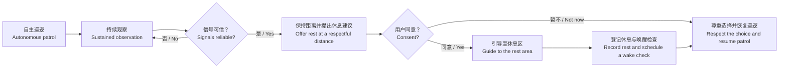
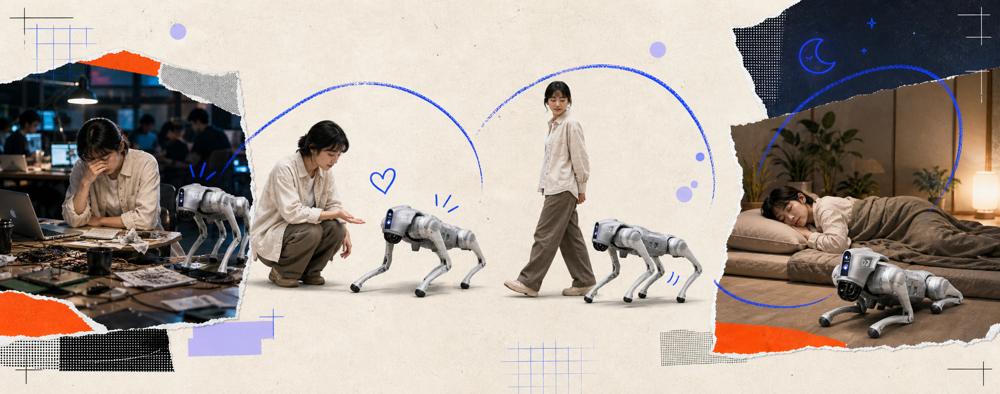
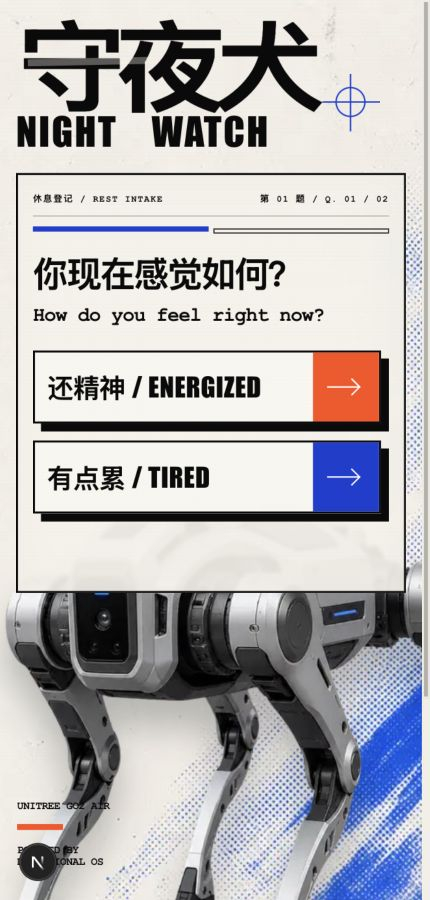
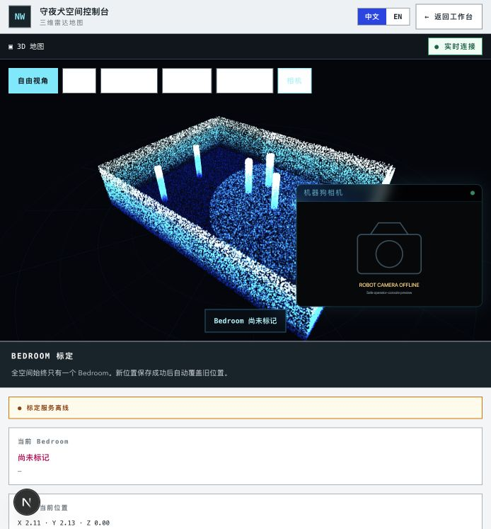
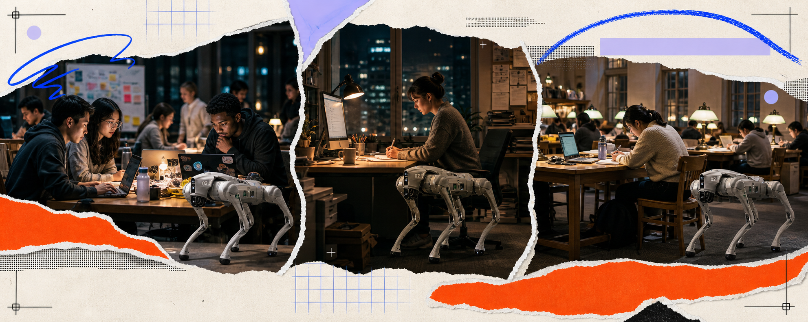
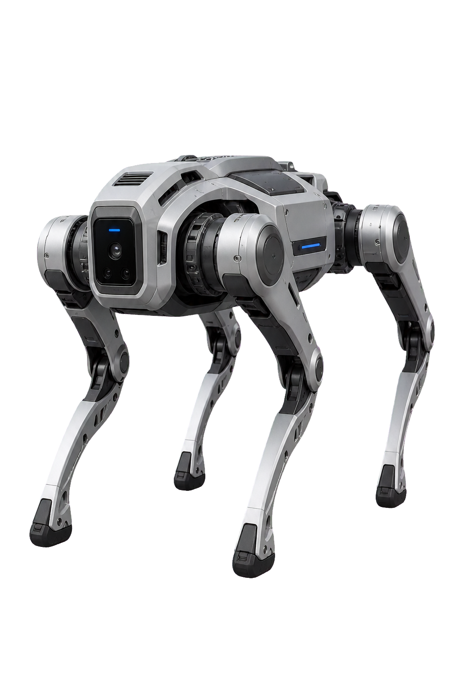

# 守夜犬 Night Watch

> **每个 AI 都想让你更努力。它想让你休息。**
> **Every AI makes you work more. This one makes you stop.**

守夜犬是一只自主行动的情绪支持机器狗。它在人们忘记照顾自己的地方巡逻，识别持续的疲劳风险，礼貌地提出休息建议，并在得到同意后引导人前往休息区。

Night Watch is an autonomous emotional-support robot dog. It patrols places where people often forget to care for themselves, notices sustained signs of fatigue, offers rest without judgment, and—only with consent—guides people toward a place to recover.

这不是一个关于“怎样让人再多工作一小时”的产品。它想回答另一个问题：

This is not a product about squeezing one more hour of work out of someone. It asks a different question:

> **如果技术能够看见人的极限，它能不能选择温柔一点？**
> **If technology can recognize human limits, can it choose to be gentle?**

---

## 目录 / Contents

- [为什么是守夜犬 / Why Night Watch](#为什么是守夜犬--why-night-watch)
- [我们的产品理念 / What we believe](#我们的产品理念--what-we-believe)
- [一次完整体验 / The experience](#一次完整体验--the-experience)
- [产品使用说明 / How to use Night Watch](#产品使用说明--how-to-use-night-watch)
- [应用场景 / Where it belongs](#应用场景--where-it-belongs)
- [为什么是一只机器狗 / Why a robot dog](#为什么是一只机器狗--why-a-robot-dog)
- [人文关怀与产品边界 / Care, dignity, and boundaries](#人文关怀与产品边界--care-dignity-and-boundaries)
- [当前产品与未来愿景 / Today and tomorrow](#当前产品与未来愿景--today-and-tomorrow)
- [常见问题 / FAQ](#常见问题--faq)

---

## 为什么是守夜犬 / Why Night Watch

### 中文

黑客松、期末周、深夜办公室都奖励坚持：更长的在线时间、更快的交付、更晚的睡眠。咖啡、能量饮料和“再坚持一下”很容易获得；真正稀缺的是一句被认真说出的“你可以休息了”。

守夜犬把休息从一种私人意志，变成一种可以被环境支持的选择。

它不会等到人主动承认“我撑不住了”。它先在空间中保持好奇：建图、巡逻、观察。当持续的疲劳信号达到可信阈值时，它不会下诊断，也不会命令人离开，而是保持距离、说明它看到的风险，并提供一个简单的选择。

休息不再意味着退出。休息成为体验闭环的一部分。

### English

Hackathons, finals week, and late-night offices reward endurance: longer hours online, faster delivery, later sleep. Coffee, energy drinks, and “just keep going” are easy to find. What is rare is a sincere invitation to stop.

Night Watch turns rest from a private act of willpower into a choice supported by the environment.

It does not wait for someone to admit that they are running on empty. It begins with curiosity—mapping, patrolling, and observing. When sustained fatigue signals cross a confidence threshold, it does not diagnose or command. It keeps a respectful distance, explains the risk it sees, and offers a simple choice.

Rest is not framed as quitting. Rest becomes part of the loop.

---

## 我们的产品理念 / What we believe

### 1. 休息不是失败 / Rest is not failure

疲劳往往被解释为不够自律、不够投入。守夜犬拒绝这种叙事。身体发出的信号不是需要被战胜的敌人，而是值得被倾听的信息。

Fatigue is often treated as a lack of discipline or commitment. Night Watch rejects that framing. Signals from the body are not enemies to defeat; they are information worth listening to.

### 2. 关怀必须建立在同意之上 / Care begins with consent

识别到疲劳风险，并不意味着系统获得了控制人的权利。守夜犬可以靠近、解释和邀请，但是否接受引导、是否留下数据、是否继续互动，都由人决定。

Recognizing fatigue risk does not grant a system authority over a person. Night Watch may approach, explain, and invite, but the person decides whether to accept guidance, share data, or continue the interaction.

### 3. 好的自主性知道什么时候克制 / Good autonomy knows when to hold back

看不清，就不下结论；置信度不足，就继续观察；路线不安全，就停下并说明原因；人拒绝了，就尊重拒绝。

If the camera cannot see clearly, the system does not guess. If confidence is low, it keeps observing. If the route is unsafe, it stops and reports why. If a person declines, that decision is respected.

### 4. 技术应该让自己可被理解 / Technology should make itself legible

控制台展示实时画面、疲劳分数、置信度、决策记录、行为状态和路线，而不是只给出一个无法解释的结论。人始终可以看见系统正在做什么。

The console shows the live feed, fatigue score, confidence, decision log, behavior state, and route instead of presenting an unexplained verdict. People should be able to see what the system is doing.

### 5. 人永远保留最后决定权 / People retain the final say

现场操作员可以暂停自主行为、手动接管、修改休息区位置或停止一次引导。安全优先于连续运动，人的判断优先于机器的计划。

An operator can pause autonomy, take manual control, change the rest-area location, or stop an escort. Safety outranks continuous motion, and human judgment outranks the robot’s plan.

---

## 一次完整体验 / The experience

<em>先看见，再询问；先得到同意，再行动。 Notice first, ask next; act only after consent.</em>

### 从访客的角度 / From the visitor’s perspective

1. **遇见 / Encounter**
   机器狗在会场中自主巡逻。你不需要下载应用或主动唤醒它。
   The robot patrols the venue on its own. You do not need to install an app or wake it up.

2. **观察 / Observe**
   系统从一段时间内的眼睛睁开程度、眨眼、点头、打哈欠、姿态和动作变化中评估疲劳风险，而不是根据单帧作判断。
   The system looks at eye openness, blinking, head nods, yawns, posture, and movement over time rather than judging from a single frame.

3. **邀请 / Invite**
   当信号持续且可信时，守夜犬停在尊重个人空间的位置，用非医疗化语言表达关切：“你看起来有点累，需要我带你去休息区吗？”
   When the signal is sustained and reliable, Night Watch stops at a respectful distance and uses non-medical language: “You look tired. Would you like me to guide you to the rest area?”

4. **选择 / Choose**
   通过二维码或 NFC 打开的手机页面，你可以说明当前状态，并选择是否接受引导。拒绝不会带来惩罚，也不会被解释为“不配合”。
   On the mobile page opened by QR or NFC, you can share how you feel and choose whether to accept guidance. Saying no carries no penalty and is never treated as non-compliance.

5. **引导 / Escort**
   如果你接受，机器狗以谨慎速度前往已经标记的休息区；路线不安全、定位不可靠或电量不足时，它会停止而不是冒险。
   If you accept, the robot moves carefully toward the marked rest area. It stops rather than taking risks when the route, localization, or battery state is unsafe.

6. **休息 / Rest**
   到达后，系统登记这次小睡并展示唤醒检查倒计时。现场人员仍然是安全与照护的最终责任人。
   On arrival, the system records the nap and displays a wake-check countdown. On-site people remain the final owners of safety and care.

  

<em>只问必要的问题，让接受帮助成为一个低压力的选择。 Only the necessary questions, so accepting help remains a low-pressure choice.</em>

---

## 产品使用说明 / How to use Night Watch

### 访客 / For visitors

| 步骤 | 中文 | English |
| --- | --- | --- |
| 1 | 扫描机器狗上的二维码或轻触 NFC 标签。 | Scan the QR code or tap the NFC tag on the robot. |
| 2 | 回答当前精神状态，以及是否希望被引导。 | Share how you feel and whether you want guidance. |
| 3 | 回答是否希望机器狗带你去休息区；选择“不用了”同样会被尊重。 | Say whether you want the robot to guide you; choosing “No” is equally respected. |
| 4 | 接受引导后，与机器狗保持舒适距离并跟随。 | If you accept, follow at a comfortable distance. |
| 5 | 到达休息区后确认登记；需要帮助时随时联系现场人员。 | Confirm arrival, and contact on-site staff whenever human help is needed. |

> **你随时可以改变主意。 / You can change your mind at any time.**

### 现场操作员 / For operators

1. **确认环境安全 / Confirm the environment is safe**
   只有在电量、定位、地图和通道状态满足要求时才启用自主行为。
   Enable autonomy only when battery, localization, map, and walkways are ready.

2. **标记休息区 / Mark the rest area**
   在空间地图中设置唯一的 `Bedroom`；新的有效位置会替换旧位置。
   Set the single `Bedroom` location in the spatial map; a newly confirmed position replaces the previous one.

3. **观察，而不是盲信 / Observe, do not blindly trust**
   同时查看实时画面、RestScore、置信度、行为状态和决策记录。
   Read the live feed, RestScore, confidence, behavior state, and decision log together.

4. **让同意先发生 / Require consent first**
   没有有效、仍在时限内的用户请求，不发起护送。
   Do not initiate escort without a valid, current user request.

5. **随时准备接管 / Stay ready to intervene**
   人群、障碍物、定位异常或任何不确定情况出现时，暂停或手动接管。
   Pause or take over when crowds, obstacles, localization issues, or uncertainty appear.

<em>空间地图让引导目的地和机器人位置保持可见、可确认、可覆盖。 The spatial map keeps the destination and robot position visible, confirmable, and overridable.</em>

---

## 应用场景 / Where it belongs

<em>在黑客松、深夜办公室与期末自习室里，同一种关怀可以适应不同的夜晚。 Across hackathons, late-night offices, and finals study halls, the same care can meet different kinds of nights.</em>

| 场景 / Setting | 人的处境 / Human need | 守夜犬的角色 / Night Watch’s role |
| --- | --- | --- |
| **黑客松 / Hackathons** | 高强度协作、时间感消失、休息容易被团队节奏吞没。 Intense collaboration, lost sense of time, and rest crowded out by team momentum. | 在会场巡逻，提供不带评判的休息入口，并引导到明确的休息区。 Patrol the venue, offer a judgment-free invitation, and guide people to a designated rest area. |
| **深夜办公室 / Late-night offices** | 独自加班时缺少同伴提醒，疲劳往往被误认为效率下降。 People working alone have fewer social cues, and fatigue is often mistaken for poor performance. | 让提醒来自环境而非主管，减少“被考核”的压力。 Let the environment offer care without turning it into managerial evaluation. |
| **高校与期末周 / Universities and finals** | 学生把熬夜当作投入的证明，却很难判断何时应该停下。 Students may treat all-nighters as proof of commitment and struggle to know when to stop. | 提供清晰、低压力的休息选择，并连接校园已有的休息空间。 Offer a clear, low-pressure rest option connected to existing campus spaces. |
| **创意工作室与实验室 / Studios and labs** | 长时间专注会降低自我觉察，安全敏感工作尤其需要及时中断。 Deep focus reduces self-awareness, especially in safety-sensitive work. | 在不打断正常节奏的前提下，发现持续风险并提醒现场负责人。 Notice sustained risk without constantly interrupting the room, and surface it to responsible staff. |
| **展会、活动与夜间公共空间 / Events and overnight public spaces** | 人流变化大、环境陌生，找到可信赖的休息位置并不容易。 Crowds shift quickly, environments are unfamiliar, and trusted rest spaces can be hard to find. | 成为一个可见、会移动的引导入口，把人带到经过确认的目的地。 Act as a visible, mobile point of guidance toward a verified destination. |

守夜犬不适合被部署为员工绩效工具、医疗诊断设备、强制行为管理系统，或没有现场人员负责的自动安全系统。

Night Watch should not be deployed as an employee performance tool, a medical diagnostic device, a coercive behavior-management system, or an unattended automated safety system.

---

## 为什么是一只机器狗 / Why a robot dog

  

### 中文

机器狗不是一个为了吸引注意力而套上的外壳。它让产品具备三种普通屏幕很难同时提供的能力：

- **它能来到你身边。** 提醒不再被锁在网页或手机通知中。
- **它的意图容易被读懂。** 靠近、停下、转身、等待、带路，这些空间动作比抽象状态更直观。
- **它可以成为温和的社会角色。** 人们更容易把一次邀请理解为关心，而不是考核或命令。

但“像狗”不代表可以牺牲安全。Go2 没有真正的尾巴或活动颈部；所有拟犬动作必须服从运动控制、避障、急停和人工接管。

### English

The robot dog is not a decorative shell added for attention. It gives the product three capabilities that an ordinary screen rarely provides at the same time:

- **It can come to you.** Care is no longer trapped inside a webpage or notification.
- **Its intent is spatially legible.** Approaching, stopping, turning, waiting, and leading are easier to understand than an abstract status.
- **It can occupy a gentle social role.** An invitation can feel like concern rather than evaluation or command.

But “dog-like” must never override safety. The Go2 has no real tail or actuated neck; every expressive motion remains subordinate to motion control, obstacle avoidance, emergency stop, and human override.

---

## 人文关怀与产品边界 / Care, dignity, and boundaries

### 我们主动选择不做什么 / What we deliberately refuse to do

| 边界 / Boundary | 中文 | English |
| --- | --- | --- |
| **不是医疗诊断 / Not medical diagnosis** | 只表达“疲劳风险”或“你看起来有点累”，不声称判断疾病、睡眠障碍或身体安全。 | It says “fatigue risk” or “you look tired,” never claiming to diagnose illness, sleep disorders, or physical safety. |
| **不是单帧裁决 / Not a single-frame verdict** | 使用滚动时间窗口、置信度与画面质量；信号不足时选择不行动。 | It uses a rolling window, confidence, and image quality; weak evidence leads to abstention. |
| **不是默认身份识别 / Not identity by default** | 默认使用匿名、会话级轨迹；别名与长期关联必须主动同意。 | Anonymous, session-scoped tracks are the default; aliases and persistent associations require explicit consent. |
| **不是原始视频仓库 / Not a raw-video archive** | 原始视频只有在单独同意时才保存。 | Raw video is retained only through a separate opt-in. |
| **不是强制休息 / Not forced rest** | 系统可以邀请，不能命令；用户可以拒绝、暂停或退出。 | The system may invite, never command; people may decline, pause, or leave. |
| **不是无人值守照护 / Not unattended care** | 现场人员、急停和人工判断始终存在。 | On-site staff, emergency stop, and human judgment remain present. |

### 一条重要的产品原则 / A core product principle

> **关怀不是“系统替你决定什么对你最好”，而是让一个更好的选择在你需要时变得容易。**
> **Care is not a system deciding what is best for you. It is making a better choice easier when you need it.**

---

## 当前产品与未来愿景 / Today and tomorrow

为了诚实地介绍守夜犬，我们把当前可展示体验与长期愿景分开。

To describe Night Watch honestly, we separate what can be demonstrated today from the longer-term vision.

### 当前可展示 / Demonstrable today

- 双语品牌介绍与手机端休息登记
  Bilingual product introduction and mobile rest intake
- 实时摄像头、RestScore、置信度与决策记录界面
  Live camera, RestScore, confidence, and decision-log interface
- Go2 连接、手动控制、自主探索、建图与导航基础能力
  Go2 connectivity, manual control, autonomous exploration, mapping, and navigation foundations
- 三维空间地图、机器人位置以及唯一休息区 `Bedroom` 的标记
  3D spatial map, robot position, and a single marked `Bedroom`
- 操作员暂停、恢复、接管和安全状态查看
  Operator hold, resume, takeover, and safety-state visibility
- 休息登记、待引导请求与可见的唤醒检查倒计时
  Rest intake, pending escort requests, and a visible wake-check countdown

### 仍需继续验证或开发 / Still being validated or built

- 从持续疲劳风险到自动靠近、邀请、护送、恢复巡逻的完整现场闭环
  The complete field loop from sustained fatigue risk to approach, invitation, escort, and patrol recovery
- 多人休息区的自动轮巡
  Automated rounds for multiple resting people
- 非接触式呼吸趋势估计
  Contactless breathing-trend estimation
- 物品状态变化提醒
  Belongings-change alerts
- 从轻声提醒到动作提示的自动唤醒阶梯
  An automatic wake ladder from gentle audio to physical gestures

这些方向只有在通过真实场地、安全和误判测试后，才会成为产品承诺。

These directions become product promises only after real-world, safety, and false-positive testing.

---

## 一段我们希望发生的故事 / The story we hope to enable

### 中文

凌晨两点二十七分，你还在改最后一个功能。你没有觉得自己需要帮助，只是开始反复读同一段代码。

一只机器狗从走廊经过。它没有响起警报，也没有在大屏幕上写下你的名字。它停在一段不会让你不舒服的距离，告诉你：“你看起来有点累。要不要去休息一下？”

你可以说“不”。也可以扫一下它身上的二维码，选择“带我去休息区”。

它转身，走得不快。你跟在后面。项目没有因为这二十分钟消失，而你终于重新感觉到自己的身体。

### English

It is 2:27 a.m. You are still fixing the last feature. You do not feel that you need help; you have simply started rereading the same block of code.

A robot dog passes through the corridor. It does not sound an alarm or put your name on a public screen. It stops at a distance that does not feel intrusive and says, “You look tired. Would you like to rest?”

You can say no. Or you can scan the code on its body and choose, “Guide me to the rest area.”

It turns and walks slowly. You follow. The project does not disappear because of twenty minutes of rest, and you begin to feel your body again.

---

## 常见问题 / FAQ

### 它是在判断我有没有生病吗？ / Is it deciding whether I am ill?

不是。守夜犬只表达可解释的疲劳风险，不提供医疗诊断，也不能替代医生、现场急救或个人健康判断。

No. Night Watch communicates explainable fatigue risk. It is not a medical diagnostic tool and cannot replace a clinician, first aid, or personal health judgment.

### 它会保存我的脸吗？ / Does it save my face?

默认不会。当前设计优先使用匿名、会话级轨迹；原始视频、别名或长期身份关联需要独立且明确的同意。

Not by default. The design prioritizes anonymous, session-scoped tracks. Raw video, aliases, or persistent identity associations require separate, explicit consent.

### 如果我不想休息呢？ / What if I do not want to rest?

直接拒绝即可。系统会尊重选择、进入冷却并恢复巡逻，不会公开展示你的拒绝，也不会强制引导。

Simply decline. The system respects the choice, enters a cooldown, and resumes patrol. It does not publicly expose the refusal or force an escort.

### 为什么不用手机通知？ / Why not just send a phone notification?

通知很容易被忽略，而且它要求系统先知道“你是谁”。守夜犬以空间中的可见存在提供帮助，可以在不默认建立持久身份的情况下靠近、等待和带路。

Notifications are easy to ignore and often require the system to know who you are. Night Watch offers help as a visible presence in the space; it can approach, wait, and guide without requiring persistent identity by default.

### 它可以独立照看睡着的人吗？ / Can it independently watch over sleeping people?

不能把它当作无人值守的安全或医疗系统。自动轮巡、呼吸趋势和物品变化仍是后续方向；即使未来实现，也必须保留现场人员与明确的责任边界。

It must not be treated as an unattended safety or medical system. Automated rounds, breathing trends, and belongings monitoring remain future directions; even when implemented, they require on-site people and explicit responsibility boundaries.

---

## 结语 / Closing

我们制造了越来越多帮助人坚持、加速和产出的 AI。守夜犬选择反过来：它把感知、推理、移动和交互用在一句简单的话上——**你可以休息。**

We keep building AI that helps people persist, accelerate, and produce. Night Watch chooses the reverse: it uses perception, reasoning, movement, and interaction to deliver one simple message—**you are allowed to rest.**

> **守夜犬 Night Watch**
> Autonomous patrol · fatigue triage · guided rest
> AdventureX 2026 · Theme: **Reverse**
