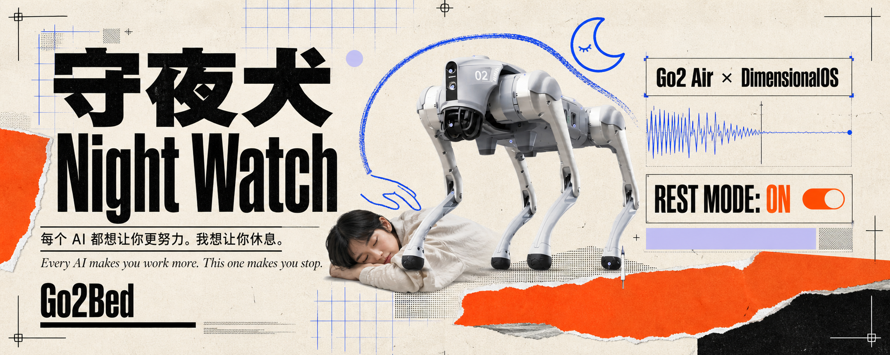
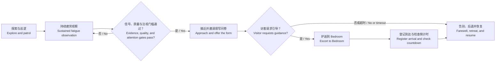
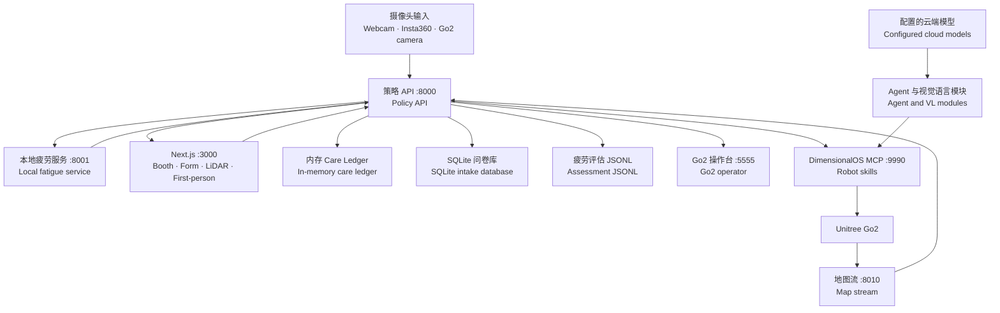

# 守夜犬 Night Watch

## 赛道问答 / Track Q&A

> 以下问题是比赛赛道的提交要求，在文档最前面统一回答。
>
> The questions below are required by the competition track and are answered up front.

**一句话：你做了什么，给谁用 / One sentence: what we built, and for whom**

守夜犬是一只自主行动的情绪支持机器狗，为任何需要被照看的人服务（老年人、养老院、行动不便或有障碍的人群，以及熬夜的工作者）；本次演示聚焦它的睡眠关怀场景：发现持续疲劳的人，礼貌邀请，在征得同意后把人带到最近的休息区。

Night Watch is an autonomous emotional-support robot dog for anyone who might need looking after (the elderly, nursing-home residents, people with disabilities, and late-night workers). The current demo focuses on its sleep-care scenario: it notices sustained fatigue, offers a polite invitation, and escorts consenting visitors to the nearest rest area.

**问题：你为什么选择做这个主题 / Why this theme**

比赛主题是 Reverse。几乎所有 AI 产品都在让人更高效、工作更久，我们把方向反过来：让 AI 劝人停下来。熬夜的人往往最后一个察觉自己的疲劳，而来自主管或手机推送的提醒容易变成考核压力；一只不带评判、能走到你身边的机器狗，恰好能补上这个空隙。

The competition theme is Reverse. Almost every AI product pushes people to work faster and longer, so we reversed the direction: an AI that asks you to stop. Tired people are usually the last to notice their own fatigue, and a reminder from a manager or a phone notification can feel like evaluation. A judgment-free robot dog that can physically come to your side fills that gap.

**作品：机器人具体在干什么 / What the robot actually does**

产品的完整定位是一只情绪支持机器狗；本次演示实现的是其中的睡眠关怀闭环。它自主探索场地并建图，巡逻时用本地视觉服务对着机器人相机持续做面部疲劳分析（多帧证据、置信度与质量门控）；识别到持续疲劳后靠近对方、语音问候，并展示背上的二维码问卷；访客提交问卷、操作员在工作台确认后，机器人先语音播报，再带路前往最近的标记休息区，到达后登记休息事件并显示唤醒检查倒计时；若访客表示不需要带领，它播一句关怀语音后离开。全程支持急停与人工接管，低电量会自动趴下待援。

The full vision is an emotional-support robot dog; this demo implements its sleep-care loop. It explores and maps the venue autonomously, and while patrolling it runs continuous facial fatigue analysis on the robot camera through a local vision service (multi-frame evidence with confidence and quality gates). When it sees sustained fatigue it approaches, greets the person by voice, and presents the QR questionnaire on its back. After the visitor submits the form and the operator confirms on the workbench, the robot announces out loud and leads the way to the nearest marked rest area, registers the arrival, and shows a wake-check countdown. If the visitor declines an escort, it speaks one caring line and moves on. Emergency stop and manual takeover are available throughout, and the dog lies down to wait when its battery runs low.

**DimOS：用了哪些能力，自己额外写了什么 / DimOS capabilities used, and what we wrote ourselves**

用到的 DimOS 能力：Go2 WebRTC 连接与运动控制；导航栈（LiDAR 体素建图、A* 规划与 costmap、frontier 探索、点击导航）；感知（相机流、YOLO 人体检测与跟踪、CLIP 空间记忆嵌入）；记忆（SpatialMemory 语义地图与地点标注、地图导出）；技能框架与 MCP 工具链，接入 LLM Agent（OpenAI gpt-4o）驱动对话与技能调用；rerun 遥测可视化。

自己额外写的（`nightwatch/`、`server/`、`client/`）：Curiosity 行为监督器（自主 / 睡眠分析 / 手动三模式编排、好奇跟随、拟犬手势）；人脸疲劳评分服务与策略桥（RestScore、门控、护送评分）；不可打断的护送技能（最近休息区、到达判定）；QR/NFC 问卷与签名令牌绑定、操作员收件箱与确认弹窗；双语操作工作台（遥操作、LIDAR 三维页、语音按钮）与公网表单隧道部署；中英混合自然语音链（kokoro 优先、edge-tts、`say` 兜底、预合成 wav 缓存）；以及一批可靠性改造（玻璃「蜜罐」自动拉黑导航层（LIDAR 看不见玻璃，详见下文专章）、地图持久化与 ICP 重定位共识、用 YOLO 替代需要 CUDA 的 EdgeTAM 跟踪器、Go2 运动使能修复、Agent 异常自愈）。

DimOS capabilities we used: the Go2 WebRTC connection and motion control; the navigation stack (LiDAR voxel mapping, A* planning with costmaps, frontier exploration, click-to-navigate); perception (camera streaming, YOLO person detection and tracking, CLIP embeddings for spatial memory); memory (SpatialMemory semantic mapping and place tagging, map export); the skill framework and MCP toolchain with an LLM agent (OpenAI gpt-4o) driving conversation and skill calls; and rerun telemetry visualization.

What we wrote ourselves (`nightwatch/`, `server/`, `client/`): the Curiosity behavior supervisor (orchestrating autonomous, sleep-analysis, and manual modes, curious following, dog-like gestures); the facial fatigue scoring service and policy bridge (RestScore, gating, escort scoring); the uninterruptible escort skill (nearest rest area, arrival detection); the QR/NFC questionnaire with signed-token binding plus the operator inbox and confirmation dialogs; the bilingual operator workbench (teleoperation, 3D LiDAR page, voice buttons) and the public form tunnel deployment; the bilingual natural-voice TTS chain (kokoro first, edge-tts, `say` fallback, pre-synthesized wav cache); and a set of reliability fixes (the glass-honeypot self-blacklisting navigation layer described in its own section below, map persistence with ICP relocalization consensus, a YOLO tracker replacing the CUDA-only EdgeTAM, Go2 motion-enable repair, agent error self-healing).

**人工介入的程度：哪些是遥控的，哪些是自主的 / Human intervention: what is teleoperated, what is autonomous**

自主执行：探索与建图、巡逻、疲劳扫描、发现并靠近疲劳者、护送时的导航与避障、到达登记、低电量趴下。

人工介入（工作台）：三种运行模式由操作员切换；手动模式下是键盘遥操作，急停随时可用；护送派发是人工门控的：机器人当面邀请、访客扫码即时确认的会话会直接护送（访客本人即时同意），而来自公网问卷的请求必须由操作员在弹窗中确认，或提前打开 AUTO ESCORT 开关作为长效授权；语音播报按钮与拟犬动作按钮也都是手动触发。原则是：一份公开问卷永远不能单独指挥机器人，环路里必须有一次人的确认。

Autonomous: exploration and mapping, patrol, fatigue scanning, finding and approaching tired people, navigation and obstacle avoidance during escorts, arrival registration, and the low-battery lie-down.

Human in the loop (the workbench): the operator switches among the three operating modes; manual mode is keyboard teleoperation, and emergency stop is always available. Escort dispatch is human-gated: a session the robot opened in person, confirmed on the spot by the visitor scanning its QR code, escorts directly (the visitor's own immediate consent), while any request arriving from the public form must be confirmed by the operator in a popup dialog, or pre-authorized by arming the AUTO ESCORT switch. The voice preset buttons and dog-gesture buttons are also manual. The principle: a public form submission alone can never command the robot; a human confirmation is always in the loop.

**（可选）商业落地的可能：谁会付钱，用户是谁 / (Optional) Commercial potential: who pays, who uses it**

有，而且比单一的睡眠场景大得多，因为产品的本体是情绪支持机器狗，睡眠关怀只是本次演示选取的第一个切口。同一套能力（自主巡逻、发现需要关照的人、温和地靠近与陪伴、征得同意后引导到安全位置、把情况汇报给现场负责人）可以直接迁移到养老院与老年社区（巡视、陪伴、引导回房、异常时通知护工）、康复与残障辅助场景（行动不便者的陪走与引路）、医院候诊与夜间公共空间。付费方是机构与场地方，而不是被照看的人本人：养老与照护机构（人手最紧缺、支付意愿最明确的市场）、活动主办方、企业园区（员工关怀 / EHS 预算）、高校。用户是这些空间里需要被照看的人：老人、行动不便者、熬夜的工作者与学生。可行形态是机器人即服务（长期驻场订阅 + 活动租赁），这套感知与护送栈也可以授权给机器人厂商作为关怀类应用预装。边界同样清晰：辅助而非替代照护人员，不做绩效监控，不做医疗诊断，不做无人值守的安全监护。

Yes, and the opportunity is much larger than the sleep scenario alone, because the product is an emotional-support robot dog; sleep care is just the first slice we chose to demo. The same capability stack (autonomous patrol, noticing someone who needs attention, a gentle approach and companionship, consent-based guidance to a safe place, and reporting to on-site staff) transfers directly to nursing homes and elder-care communities (rounds, companionship, guiding residents back to their rooms, alerting caregivers), rehabilitation and disability support (walking alongside and guiding people with limited mobility), hospital waiting areas, and overnight public spaces. The payer is the institution or venue rather than the person being cared for: elder-care operators (the market with the most acute staffing shortage and the clearest willingness to pay), event organizers, corporate campuses (employee-care or EHS budgets), and universities. The users are the people who need looking after in those spaces: the elderly, people with limited mobility, and late-night workers and students. The likely shape is robot-as-a-service (long-term on-site subscription plus event rental), and the sensing and escort stack could also be licensed to robot vendors as a preinstalled care application. The boundaries stay firm: it assists caregivers instead of replacing them, with no performance monitoring, no medical diagnosis, and no unattended safety monitoring.

---



> **每个 AI 都想让你更努力。它想让你休息。**
>
> **Every AI makes you work more. This one makes you stop.**

守夜犬是一套面向 Unitree Go2 的疲劳关怀原型。它在场地中探索和巡逻，通过本地视觉服务评估持续的疲劳风险，在风险信号可靠时礼貌靠近，并通过二维码或 NFC 问卷询问访客是否需要引导。只有访客明确提出请求后，机器人闭环才会尝试将其护送到已标记的休息区。

Night Watch is a fatigue-care prototype built around a Unitree Go2. It explores and patrols a venue, uses a local vision service to assess sustained fatigue risk, approaches politely when the evidence is reliable, and asks through a QR or NFC form whether the visitor wants guidance. The robot loop attempts an escort to a marked rest area only after the visitor explicitly requests it.

当前实现可以登记到达休息区的事件，并在展台界面显示唤醒检查倒计时。自动轮巡、物品变化监测、非接触式呼吸趋势估计和自动唤醒阶梯仍属于后续方向，不是当前演示能力，也不能被表述为医疗或无人值守安全功能。

The current implementation can register arrival at the rest area and show a visible wake-check countdown on the booth console. Automated sleeper rounds, belongings-change monitoring, contactless breathing trends, and an automatic wake ladder remain future work. They are not current demo capabilities and must not be presented as medical or unattended safety features.

为 [AdventureX 2026](https://adventurex.org) 构建 · 主题：**Reverse** · `#adventurex2026`

Built for [AdventureX 2026](https://adventurex.org) · Theme: **Reverse** · `#adventurex2026`

---

## 目录 / Contents

- [赛道问答 / Track Q&A](#赛道问答--track-qa)
- [当前实现与能力边界 / Current implementation and boundaries](#当前实现与能力边界--current-implementation-and-boundaries)
- [当前体验闭环 / Current experience loop](#当前体验闭环--current-experience-loop)
- [看不见的玻璃 / Finding glass that LIDAR cannot see](#看不见的玻璃--finding-glass-that-lidar-cannot-see)
- [页面入口 / Application pages](#页面入口--application-pages)
- [疲劳风险如何计算 / How fatigue risk is calculated](#疲劳风险如何计算--how-fatigue-risk-is-calculated)
- [系统架构 / System architecture](#系统架构--system-architecture)
- [技术栈 / Technology](#技术栈--technology)
- [数据、隐私与安全边界 / Data, privacy, and safety boundaries](#数据隐私与安全边界--data-privacy-and-safety-boundaries)
- [本地开发 / Local development](#本地开发--local-development)
- [Go2 集成模式 / Integrated Go2 mode](#go2-集成模式--integrated-go2-mode)
- [主要接口 / Selected API endpoints](#主要接口--selected-api-endpoints)
- [验证与测试 / Verification and tests](#验证与测试--verification-and-tests)
- [更多文档 / Further documentation](#更多文档--further-documentation)

---

## 当前实现与能力边界 / Current implementation and boundaries

为了避免把路线图写成已经完成的功能，下面按实际状态区分当前能力。

To avoid presenting the roadmap as finished functionality, the capabilities below are separated by their current status.

| 状态 / Status | 中文 | English |
| --- | --- | --- |
| **代码已接通 / Implemented in software** | 多人脸跟踪、RestScore、置信度与质量门控；展台、问卷和三维地图页面；Go2 状态与控制桥；持续疲劳风险触发接近；问卷明确请求后护送至唯一 `Bedroom`；到达登记与唤醒检查倒计时。 | Multi-face tracking, RestScore, confidence and quality gates; booth, intake, and 3D map pages; Go2 status and control bridge; approach after sustained fatigue risk; escort to the single `Bedroom` after an explicit form request; arrival registration and a wake-check countdown. |
| **依赖现场配置 / Requires field configuration** | 真实 Go2 巡逻与护送、可靠定位和避障、休息区标定、机器人局域网、DimensionalOS 环境，以及机器人 Agent 和部分视觉能力所需的云端 API 配置。 | Physical Go2 patrol and escort, reliable localization and obstacle avoidance, rest-area calibration, the robot LAN, a DimensionalOS environment, and cloud API configuration used by the robot agent and some vision capabilities. |
| **尚未实现 / Not implemented** | 多人睡眠区自动轮巡、物品状态变化提醒、呼吸趋势估计、自动唤醒阶梯，以及无人值守的睡眠安全监护。 | Automated rounds for multiple sleepers, belongings-change alerts, breathing-trend estimation, an automatic wake ladder, and unattended sleep-safety monitoring. |

这是一套研究与现场演示原型，不是医疗诊断设备，也不能替代现场人员、急救流程或个人健康判断。

This is a research and field-demo prototype. It is not a medical diagnostic device and cannot replace on-site staff, first aid, or personal health judgment.

---

## 当前体验闭环 / Current experience loop



当前桥接逻辑不会因为单帧高分立即采取动作。它要求同一匿名轨迹在最短观察时间内连续达到分数、置信度和画面质量阈值，同时要求访客正面关注摄像头，并应用每人冷却时间。通过门控后，机器人先执行 `potential_detected` 接近协议，再给访客三分钟通过二维码或 NFC 回答问卷。

The current bridge never acts on a single high-scoring frame. It requires consecutive windows from the same anonymous track to pass score, confidence, image-quality, minimum-observation-time, direct-attention, and per-person cooldown gates. Once those gates pass, the robot first runs the `potential_detected` approach protocol and then gives the visitor three minutes to answer through QR or NFC.

问卷只询问访客当前是否精神，以及是否需要引导。只有回答“有点累”且明确选择需要引导时，系统才调用 `escort_to_sleeping_area`。拒绝、超时、机器人离线、保持状态、定位不可靠或没有可用 `Bedroom` 都会阻止护送。

The form asks only how alert the visitor feels and whether guidance is wanted. The system calls `escort_to_sleeping_area` only when the visitor reports being tired and explicitly requests guidance. A refusal, timeout, offline robot, active hold, unreliable localization, or missing `Bedroom` prevents the escort.

---

## 看不见的玻璃 / Finding glass that LIDAR cannot see

现场演示里最危险的障碍不是墙，而是玻璃。激光雷达的光束会直接穿过透明表面，返回信号极弱甚至没有，所以在占据栅格地图里，玻璃幕墙看起来是一片可以通行的自由空间，后面还跟着一大块诱人的未知区域。透明障碍物检测研究（TOPGN，[arXiv:2408.05608](https://arxiv.org/abs/2408.05608)）指出，可靠识别玻璃通常需要处理激光点云的反射强度或引入额外的感知通道，而 Go2 通过 WebRTC 下发的压缩体素地图恰恰不携带强度信息。结果是一个「蜜罐」：frontier 探索的评分最偏爱未知区域，而玻璃后面的未知永远无法被消解，机器狗会一次又一次走向同一面窗。

The most dangerous obstacle in a live venue is not a wall, it is glass. LIDAR beams pass straight through transparent surfaces and return little or no signal, so in an occupancy map a glass wall reads as traversable free space with a tempting pool of unknown territory behind it. Transparent-obstacle research (TOPGN, [arXiv:2408.05608](https://arxiv.org/abs/2408.05608)) shows that reliably detecting glass generally requires intensity-aware processing of the lidar point cloud or an additional perception channel, and the compressed voxel map the Go2 publishes over WebRTC carries no intensity data at all. The result is a honeypot: frontier scoring rewards unknown area, the unknown behind a pane can never be resolved, and the dog walks into the same window again and again.

传感器层解决不了，我们就在导航层自研了一套「玻璃自动拉黑」机制（[`nightwatch/nightwatch/navigation.py`](nightwatch/nightwatch/navigation.py)）：

Since the sensor layer cannot solve this, we built an in-house self-blacklisting layer inside navigation ([`nightwatch/nightwatch/navigation.py`](nightwatch/nightwatch/navigation.py)):

1. **到达未消解即记违例 / Arrival-without-resolution strikes.** 真正的 frontier 会在机器人到达后被激光扫掉：目标周围的未知栅格坍缩为已知。如果一次「成功」的行程结束后未知区域仍然完好，这就是玻璃的签名（激光穿过玻璃，窗后的未知永远不会清除），该目标记一次违例；规划器硬失败且未知未消解时直接记满违例。<br>
   A real frontier resolves on arrival: the lidar sweep collapses the unknown cells around the goal. A goal that terminates with its unknown mass intact is the glass signature (the beam passes through, so the unknown behind the pane never clears) and earns a strike. A hard planner failure with unresolved unknown strikes out immediately.
2. **三振出局 / Strike-out blacklist.** 同一 1.5 m 区域累计三次违例后，整个会话永久拉黑。基于时间的黑名单会过期然后让机器狗折返，而窗户永远是窗户。<br>
   Three strikes in the same 1.5 m region blacklist it for the rest of the session. Time-based blacklists expire and invite the dog back; the window never stops being a window.
3. **持久 keep-out / Persistent keep-outs.** 玻璃区域以地图坐标写入 keep-out 文件，跨进程重启保留，探索和巡逻共同强制执行；在重定位锁定之前保持休眠，避免坐标漂移误伤。<br>
   Glass zones are persisted in the map frame, survive restarts, and are enforced by exploration and patrol alike. They stay dormant until relocalization locks, so a drifting frame cannot misplace them.
4. **出生点只出不进 / One-way egress at the boot pose.** 现场机器人恰好在玻璃幕墙旁边开机，所以会话起点被当作出口而不是目的地：一旦离开，任何朝出生点回退的目标都会被拒绝。<br>
   The robot powers on beside the venue's glass wall, so the session origin is treated as an exit, never a destination: once the dog leaves, goals that move back toward the boot pose are rejected.

效果是：不添加任何传感器，一面玻璃墙在最多一两次接触后就会自己进入黑名单，此后探索、巡逻和护送都会绕开它。相关行为由 `nightwatch/tests/` 中的回归测试固定。

The net effect: with no additional sensor, a glass wall blacklists itself after at most a couple of contacts, and exploration, patrol, and escort all route around it from then on. The behavior is pinned by regression tests in `nightwatch/tests/`.

---

## 页面入口 / Application pages

启动客户端和策略 API 后，可以访问以下页面。

Once the client and policy API are running, the following pages are available.

| 地址 / URL | 中文 | English |
| --- | --- | --- |
| `http://localhost:3000/` | 展台控制台：实时疲劳分析、思考流、引导队列、路线和 care ledger | Booth console: live fatigue analysis, thought stream, escort queue, route, and care ledger |
| `http://localhost:3000/form` | 手机端休息问卷；也支持带 `?s=<session_id>` 的固定二维码 | Mobile rest intake; also supports fixed QR URLs with `?s=<session_id>` |
| `http://localhost:3000/lidar` | 三维地图、机器人视角和唯一 `Bedroom` 标定 | 3D map, robot-eye view, and single-`Bedroom` calibration |
| `http://localhost:3000/first-person` | 机器人相机全屏第一视角 | Full-screen live view from the robot camera |
| `http://127.0.0.1:5555/operator` | Go2 双语操作台；只有机器人栈运行时可用 | Bilingual Go2 operator workbench; available only while the robot stack is running |

---

## 疲劳风险如何计算 / How fatigue risk is calculated

疲劳服务通过 YOLOv8-Face 检测和跟踪人脸，再使用 MediaPipe Face Landmarker 提取面部几何信息。每个 WebSocket 连接维护独立的时间窗口、匿名 `track_id` 和中性头部姿态校准。

The fatigue service detects and tracks faces with YOLOv8-Face, then extracts facial geometry with MediaPipe Face Landmarker. Each WebSocket connection maintains its own temporal window, anonymous `track_id` values, and neutral head-pose calibration.

| 信号 / Signal | 当前用途 / Current use |
| --- | --- |
| **EAR、闭眼时长、PERCLOS、眨眼时长 / EAR, eye-closure duration, PERCLOS, blink duration** | 判断持续闭眼和时间窗口内的闭眼比例；用于 RestScore 和解释信息。 / Detect sustained eye closure and the closed-eye proportion over time; used in RestScore and explanations. |
| **MAR、哈欠时长与次数 / MAR, yawn duration and count** | 判断持续张口和哈欠事件；用于 RestScore。 / Detect sustained mouth opening and yawn events; used in RestScore. |
| **相对头部俯仰与点头 / Relative head pitch and nods** | 基于个人中性姿态识别持续低头和点头；用于 RestScore。 / Detect sustained head-down posture and nods relative to a personal neutral pose; used in RestScore. |
| **头部朝向和视线 / Head orientation and gaze** | 判断注意力偏移，以及访客是否正面关注摄像头；后者是机器人自动接近门槛之一。 / Detect attention shifts and whether the visitor is looking toward the camera; direct attention is one gate for automatic approach. |
| **检测置信度和信号质量 / Detection confidence and signal quality** | 独立于分数，用于在脸部过小、模糊或缺少关键点时选择不行动。 / Kept separate from the score so the system can abstain when a face is too small, blurred, or missing landmarks. |

当前 RestScore 的基础部分由闭眼、哈欠和 PERCLOS 按 `50% / 20% / 30%` 融合，再加入持续低头和点头分量，最后限制在 `0–100`。代码还输出基于头部姿态变化的 movement entropy 和会话时长，但它们当前不进入 RestScore 主公式。

The current RestScore combines eye closure, yawning, and PERCLOS at `50% / 20% / 30%`, then adds head-down and nod components before clamping the result to `0–100`. The service also exposes head-pose movement entropy and elapsed session time, but they do not currently contribute to the main RestScore formula.

当前在线疲劳服务没有接入身体骨架的 neck–torso slump，也没有呼吸估计。不要把头部俯仰显示解释为完整身体姿态或医学结论。

The live fatigue service does not currently include body-skeleton neck–torso slump or breathing estimation. Do not interpret the displayed head pitch as full-body posture or as a medical conclusion.

详细协议和配置见 [实时疲劳检测服务说明 / Fatigue service guide](fatigue_fastapi_service/README.md)。

See the [fatigue service guide](fatigue_fastapi_service/README.md) for the full protocol and configuration.

---

## 系统架构 / System architecture



三个用户空间服务可以独立运行：

The three user-space services can run independently:

| 服务 / Service | 路径 / Path | 端口 / Port | 职责 / Role |
| --- | --- | ---: | --- |
| **Web 客户端 / Web client** | `client/` | 3000 | 展台、问卷、三维地图、第一视角 / Booth, intake, 3D map, and first-person view |
| **策略 API / Policy API** | `server/` | 8000 | 摄像头输入、care loop、问卷、ledger、机器人桥和 UI 接口 / Camera input, care loop, intake, ledger, robot bridge, and UI APIs |
| **疲劳检测 / Fatigue detection** | `fatigue_fastapi_service/` | 8001 | YOLOv8-Face、MediaPipe 和有状态时序推理 / YOLOv8-Face, MediaPipe, and stateful temporal inference |

真实机器人模式另外运行 `nightwatch/` 中的 DimensionalOS 蓝图，提供操作台、相机、地图流和 MCP 机器人技能。

Real-robot mode additionally runs the DimensionalOS blueprint in `nightwatch/`, which provides the operator workbench, camera, map stream, and MCP robot skills.

---

## 技术栈 / Technology

| 层 / Layer | 当前实现 / Current implementation |
| --- | --- |
| **机器人 / Robot** | Unitree Go2 + DimensionalOS，通过 WebRTC 接收相机、LiDAR 和机器人状态。 / Unitree Go2 + DimensionalOS, with camera, LiDAR, and robot state over WebRTC. |
| **Web** | Next.js 15、React 19、Three.js、React Three Fiber、GSAP 和 Framer Motion。 / Next.js 15, React 19, Three.js, React Three Fiber, GSAP, and Framer Motion. |
| **API** | FastAPI、Uvicorn、WebSocket、SSE 和 MJPEG。 / FastAPI, Uvicorn, WebSocket, SSE, and MJPEG. |
| **疲劳视觉 / Fatigue vision** | YOLOv8-Face、MediaPipe Face Landmarker、OpenCV 和可解释的时间阈值。 / YOLOv8-Face, MediaPipe Face Landmarker, OpenCV, and interpretable temporal thresholds. |
| **机器人 Agent / Robot agent** | 当前蓝图使用通过 OpenAI-compatible endpoint 配置的 GPT‑4o；需要网络和相应凭据。 / The current blueprint uses GPT‑4o through a configured OpenAI-compatible endpoint; network access and credentials are required. |
| **机器人视觉语言能力 / Robot vision-language capability** | 当前使用 Gemini API；疲劳检测本身不依赖它。 / Currently uses the Gemini API; the fatigue detector itself does not depend on it. |
| **语音 / Voice** | 机器人 TTS 回退链，以及两条经过审阅的展台 WAV 提示音；可用后端取决于平台与配置。 / A robot TTS fallback chain plus two reviewed booth WAV cues; available backends depend on platform and configuration. |
| **数据 / Data** | 问卷使用 SQLite；care ledger 在内存中；机器人桥可写 JSONL；DimensionalOS 单独持久化地图和语义/身份记忆。 / SQLite for intake, an in-memory care ledger, optional JSONL assessment audit, and separate DimensionalOS persistence for maps and semantic/identity memory. |

疲劳模型在安装完成并取得模型资源后可以完全本地运行；Web、策略 API 和 stub 模式也可以离线开发。完整机器人栈当前不是“无需云端”的系统。

Once installed and supplied with its model assets, fatigue inference can run entirely locally. The web app, policy API, and stub mode can also be developed offline. The complete robot stack is not currently cloud-free.

---

## 数据、隐私与安全边界 / Data, privacy, and safety boundaries

下面描述的是当前代码行为，而不是未来的隐私承诺。

The following describes current code behavior, not a future privacy promise.

- **实时分析 / Live analysis**
  当疲劳服务运行时，摄像头画面会被持续分析；当前表单没有“分析同意”问题，分析流程也没有由表单同意状态控制。自动护送仍然需要访客通过问卷明确提出引导请求。<br>
  While the fatigue service is running, camera frames are analyzed continuously. The current form has no “consent to analysis” question, and form consent does not gate analysis. An automatic escort still requires an explicit guidance request through the form.

- **匿名轨迹 / Anonymous tracks**
  疲劳服务默认使用当前 WebSocket 会话中的匿名 `track_id`，不会在 RestScore 接口中附加姓名。展台排行榜目前也会为未登记轨迹生成匿名“访客”别名；它并不是只包含主动报名的志愿者。<br>
  The fatigue service uses anonymous `track_id` values within the current WebSocket session and does not attach names to RestScore results. The booth leaderboard currently creates anonymous “visitor” aliases for unregistered tracks as well; it is not limited to volunteers who explicitly enrolled.

- **原始画面 / Raw frames**
  策略 API 的摄像头与疲劳路径不会把原始视频写入数据库，`/api/capture` 当前也只记录一个内存事件，不会保存提交的特征数组或原始视频。但真实机器人栈另有空间记忆和匿名人物 embedding；它们的本地持久化位置和删除方式见机器人说明。<br>
  The policy API camera and fatigue paths do not write raw video into the database, and `/api/capture` currently records only an in-memory event rather than persisting submitted feature arrays or raw video. The real-robot stack has separate spatial memory and anonymous-person embeddings; see the robot guide for their local persistence paths and deletion behavior.

- **问卷数据库 / Intake database**
  `data/nightwatch.db` 默认保存会话 ID、交互 ID、疲劳自述、是否需要引导、处理状态和可选别名。它不会自动保存 RestScore 历史。<br>
  By default, `data/nightwatch.db` stores session ID, interaction ID, self-reported tiredness, escort preference, handling status, and an optional alias. It does not automatically store RestScore history.

- **Care ledger**
  小睡、事件、最高分和路线计划当前保存在 `LedgerMemory` 中，策略 API 重启后会清空。它不是持久化的“整晚账本”。<br>
  Naps, events, peak scores, and route plans currently live in `LedgerMemory` and are cleared when the policy API restarts. It is not yet a persistent all-night ledger.

- **机器人审计 / Robot audit**
  启用 `ROBOT_BRIDGE_ENABLED` 后，疲劳评估默认追加到 `data/assessments.jsonl`。记录包含匿名轨迹、边界框、分数、置信度、质量和触发因素，不包含图像本身。<br>
  When `ROBOT_BRIDGE_ENABLED` is on, fatigue assessments are appended to `data/assessments.jsonl` by default. Records contain anonymous tracks, bounding boxes, scores, confidence, quality, and factors—not image data.

任何公开或长期部署都应在启用前补充明确的现场告知、数据保留周期、删除流程、访问控制和适用地区的隐私审查。当前原型不能被当作员工绩效、医疗诊断、强制行为管理或无人值守安全系统。

Before any public or long-running deployment, add clear on-site notice, retention periods, deletion procedures, access controls, and privacy review appropriate to the jurisdiction. The current prototype must not be used for employee performance evaluation, medical diagnosis, coercive behavior management, or unattended safety monitoring.

---

## 本地开发 / Local development

### 前置条件 / Prerequisites

- Node.js 20+ 与 pnpm（可使用 `corepack enable`）。<br>
  Node.js 20+ and pnpm (`corepack enable` is supported).
- 项目当前以 Python 3.12 测试 `server/` 和 `fatigue_fastapi_service/`。<br>
  The project currently tests `server/` and `fatigue_fastapi_service/` with Python 3.12.
- `server/` 可使用 [uv](https://docs.astral.sh/uv/) 或普通 `venv`。<br>
  `server/` can use [uv](https://docs.astral.sh/uv/) or a regular `venv`.
- 疲劳服务首次安装或首次运行可能需要联网下载 PyTorch 和模型资源。<br>
  The first fatigue-service install or run may need internet access to download PyTorch and model assets.

### Windows PowerShell：分别启动三个服务 / Windows PowerShell: run three services separately

Windows 本地开发使用三个终端。这个流程不启动 DimensionalOS 或真实机器人。

Windows local development uses three terminals. This flow does not start DimensionalOS or the physical robot.

#### Terminal 1 — 疲劳检测 / Fatigue detection (`:8001`)

只有 `SCORER_BACKEND=live` 时需要这个服务。

This service is required only when `SCORER_BACKEND=live`.

```powershell
cd fatigue_fastapi_service
py -3.12 -m venv .venv
.\.venv\Scripts\python.exe -m pip install -r requirements.txt
cd ..

$env:FATIGUE_DEVICE = "cpu"   # 也可以使用 auto 或 cuda:0 / auto or cuda:0
.\fatigue_fastapi_service\.venv\Scripts\python.exe -m uvicorn `
  fatigue_fastapi_service.app.main:app `
  --host 127.0.0.1 --port 8001 --workers 1
```

必须使用单 worker：一个推理进程只允许一条活动检测流。CPU-only PyTorch 和完整协议见 [fatigue_fastapi_service/README.md](fatigue_fastapi_service/README.md)。

Use one worker: one inference process accepts only one active detection stream. See [fatigue_fastapi_service/README.md](fatigue_fastapi_service/README.md) for CPU-only PyTorch installation and the full protocol.

#### Terminal 2 — 策略 API / Policy API (`:8000`)

```powershell
cd server
uv sync
if (-not (Test-Path .env.local)) {
  Copy-Item .env.example .env.local
}
uv run uvicorn app.main:app `
  --reload --host 127.0.0.1 --port 8000 `
  --timeout-graceful-shutdown 3 `
  --env-file .env.local
```

没有 `uv` 时，可以创建普通 Python 3.12 `venv`，安装 `requirements.txt`，再用该环境的 Python 运行同一条 Uvicorn 命令。

Without `uv`, create a regular Python 3.12 `venv`, install `requirements.txt`, and run the same Uvicorn command with that environment’s Python.

#### Terminal 3 — Web 客户端 / Web client (`:3000`)

```powershell
cd client
if (-not (Test-Path .env.local)) {
  Copy-Item .env.local.example .env.local
}
pnpm install
pnpm dev
```

打开 `http://localhost:3000/` 查看实时控制台。Next.js rewrite 代理普通 API；MJPEG、SSE 和 LiDAR WebSocket 通过 `NEXT_PUBLIC_API_BASE_URL=http://localhost:8000` 直接连接策略 API。

Open `http://localhost:3000/` for the live console. Next.js rewrites proxy ordinary API calls; MJPEG, SSE, and the LiDAR WebSocket connect directly to the policy API through `NEXT_PUBLIC_API_BASE_URL=http://localhost:8000`.

### 可选 Insta360 输入 / Optional Insta360 input

当 `CAMERA_SOURCE=insta360` 时，需要先在 Windows 上构建并运行专有 SDK 桥，默认端口为 `5556`。SDK 本身不随仓库分发。

When `CAMERA_SOURCE=insta360`, build and run the proprietary SDK bridge on Windows first; its default port is `5556`. The SDK itself is not distributed with this repository.

```powershell
$env:INSTA360_SDK_ROOT = "C:\path\to\Windows_CameraSDK-2.1.1_MediaSDK-3.1.3"
cd insta360_bridge
.\build.ps1
.\build\Release\insta360_bridge.exe --port 5556
```

详细设置见 [Insta360 bridge 说明 / Insta360 bridge guide](insta360_bridge/README.md)。

See the [Insta360 bridge guide](insta360_bridge/README.md) for setup details.

### 快速检查 / Quick checks

```powershell
Invoke-WebRequest http://127.0.0.1:8001/health -UseBasicParsing
Invoke-WebRequest http://127.0.0.1:8000/api/score -UseBasicParsing
Invoke-WebRequest http://localhost:3000/ -UseBasicParsing
```

---

## Go2 集成模式 / Integrated Go2 mode

`run_integrated.sh` 是 zsh 启动器，使用 Unix 风格的 `.venv/bin/python`。它适用于 macOS 或已经准备好 zsh、Python 环境和 DimensionalOS 的 Linux/WSL 环境，不能直接复用上面 native Windows 创建的 `Scripts\python.exe` 虚拟环境。

`run_integrated.sh` is a zsh launcher and expects Unix-style `.venv/bin/python` paths. It is intended for macOS or a Linux/WSL environment with zsh, Python environments, and DimensionalOS already prepared. It cannot directly reuse the `Scripts\python.exe` virtual environments created by the native Windows instructions above.

### 安装用户空间依赖 / Install user-space dependencies

```bash
python3.12 -m venv fatigue_fastapi_service/.venv
fatigue_fastapi_service/.venv/bin/python -m pip install \
  -r fatigue_fastapi_service/requirements.txt

python3.12 -m venv server/.venv
server/.venv/bin/python -m pip install -r server/requirements.txt

cd client
pnpm install
cd ..
```

不连接机器人时，默认使用本地摄像头、真实疲劳模型并关闭机器人调用：

Without the robot, the launcher defaults to the local webcam, the real fatigue model, and disabled robot calls:

```bash
./run_integrated.sh
```

完全使用 stub 进行界面开发：

For fully stubbed UI development:

```bash
CAMERA_SOURCE=stub SCORER_BACKEND=stub DEMO_MODE=stub ./run_integrated.sh
```

### 连接真实 Go2 / Connect the physical Go2

真实机器人模式还需要：

Real-robot mode additionally requires:

- 加入 Go2 局域网，并确认机器人可达且电量适合现场测试。<br>
  Join the Go2 LAN and confirm that the robot is reachable and sufficiently charged for field testing.
- 准备 sibling `dimos/` checkout，以及名为 `dimos` 的 Conda 环境或显式 `DIMOS_BIN`。<br>
  Prepare the sibling `dimos/` checkout and either a Conda environment named `dimos` or an explicit `DIMOS_BIN`.
- 通过 `robot.env` 或当前 shell 配置机器人 Agent 和 Gemini 所需的 API endpoint 与凭据。<br>
  Configure the API endpoints and credentials required by the robot agent and Gemini through `robot.env` or the current shell.
- 在三维地图中确认唯一的 `Bedroom`；没有可用目的地时，护送会被拒绝。<br>
  Confirm the single `Bedroom` in the 3D map; escorts are refused when no usable destination exists.

单独启动机器人：

Start the robot separately:

```bash
./nightwatch/run_scout.sh
```

或者让集成启动器同时启动机器人：

Or let the integrated launcher start it:

```bash
./run_integrated.sh --with-robot
```

`--with-robot` 默认选择 Go2 摄像头、启用 assessment/action bridge，并启动 scout 蓝图。可以使用 `--camera webcam`、`--camera insta360` 或其他受支持来源覆盖摄像头。

`--with-robot` selects the Go2 camera, enables the assessment/action bridge, and starts the scout blueprint by default. Use `--camera webcam`, `--camera insta360`, or another supported source to override the camera.

启动器读取当前 shell 环境，但不会自动加载 `server/.env.local`。可配置项和默认值见 [`server/.env.example`](server/.env.example)。机器人操作、地图、持久化和安全边界见 [Go2 scout 说明 / Go2 scout guide](nightwatch/README.md)。

The launcher reads the current shell environment but does not automatically load `server/.env.local`. See [`server/.env.example`](server/.env.example) for configurable values and defaults. See the [Go2 scout guide](nightwatch/README.md) for robot operation, maps, persistence, and safety boundaries.

### 公访问卷 / Public intake

根 README 不固定某一台公网服务器。将 HTTPS 问卷地址通过环境变量传给机器人操作台：

The root README does not pin the project to one public server. Pass the HTTPS intake URL to the robot workbench through an environment variable:

```bash
NIGHTWATCH_PUBLIC_FORM_URL=https://<your-domain>/form \
  ./run_integrated.sh --with-robot
```

腾讯云部署、受限公开接口和可选 SSH 反向同步见 [腾讯云问卷部署说明](deploy/tencent/README.md)。同步密钥存在时，`run_integrated.sh` 会自动启动隧道；隧道中断不会阻止云端保存，但不会自动补发离线期间的提交。

See the [Tencent Cloud intake deployment guide](deploy/tencent/README.md) for deployment, restricted public routes, and optional SSH reverse synchronization. When the sync keys exist, `run_integrated.sh` starts the tunnel automatically. A tunnel outage does not prevent cloud persistence, but submissions made during the outage are not replayed automatically.

---

## 主要接口 / Selected API endpoints

这是主要接口列表，而不是完整 OpenAPI 参考。策略 API 运行后，可在 `http://127.0.0.1:8000/docs` 查看 HTTP 接口。

This is a selected endpoint list, not the complete OpenAPI reference. Once the policy API is running, its HTTP API is available at `http://127.0.0.1:8000/docs`.

| 接口 / Endpoint | 方法 / Method | 用途 / Purpose |
| --- | --- | --- |
| `/video_feed/pov` | GET | 当前摄像头原始 MJPEG / Raw MJPEG from the selected camera |
| `/video_feed/annotated` | GET | 疲劳标注 MJPEG / Fatigue-annotated MJPEG |
| `/video_feed/robot` | GET | Go2 第一视角 MJPEG 代理 / Go2 first-person MJPEG proxy |
| `/text_stream/thoughts` | GET | 策略事件 SSE / Policy-event SSE |
| `/ws/lidar` | WebSocket | 三维点云和机器人位姿中继 / 3D point-cloud and robot-pose relay |
| `/api/score` | GET | 最新多人疲劳结果 / Latest multi-person fatigue result |
| `/api/audio/{cue_id}` | GET | 经过审阅的展台 WAV / Reviewed booth WAV cue |
| `/api/plan` | GET | 展台路线计划与 ETA / Booth route plan and ETAs |
| `/api/ledger` | GET | 当前内存中的 care ledger / Current in-memory care ledger |
| `/api/leaderboard` | GET | 当前会话最高 RestScore / Current-session peak RestScores |
| `/api/form/schema` | GET | 问卷、会话和当前交互 ID / Form, session, and active interaction ID |
| `/api/form/responses` | POST | 提交休息问卷 / Submit rest intake |
| `/api/form/responses/latest` | GET | 最近问卷记录 / Latest intake records |
| `/api/form/responses/pending-escort` | GET | 待处理引导请求 / Pending escort requests |
| `/api/form/responses/{id}` | PATCH | 确认、完成或拒绝请求 / Acknowledge, complete, or decline a request |
| `/api/robot/status` | GET | 机器人、行为、地图和桥状态 / Robot, behavior, map, and bridge status |
| `/api/robot/action` | POST | 白名单姿态动作：Lie down / Stand / Allow-listed posture actions: Lie down / Stand |
| `/api/robot/fatigue-auto-takeover` | PUT | 设置手动模式下的疲劳自动接管 / Configure fatigue auto-takeover in manual mode |
| `/api/robot/approach-nearest` | POST | 操作员触发接近最近的人 / Operator-triggered nearest-person approach |
| `/api/robot/cancel-interaction` | POST | 取消当前交互 / Cancel the active interaction |
| `/api/robot/bedroom` | GET, PUT | 读取或覆盖唯一 `Bedroom` / Read or replace the single `Bedroom` |
| `/api/adopt` | POST | 旧版领养/别名接口 / Legacy adoption and alias endpoint |
| `/api/capture` | POST | 旧版采集事件接口；当前不持久化 payload / Legacy capture-event endpoint; payload is not currently persisted |
| `/api/outcome` | POST | 登记醒后反馈 / Record a post-rest outcome |

当配置了 `INTAKE_OPERATOR_KEY` 时，问卷状态修改需要 `X-Intake-Operator-Key`。未配置时，本地开发接口不会要求该 header。

When `INTAKE_OPERATOR_KEY` is configured, intake status changes require `X-Intake-Operator-Key`. Without it, the local development endpoint does not require that header.

---

## 验证与测试 / Verification and tests

服务端和疲劳服务的测试依赖分别列在各自的 `requirements-dev.txt` 中。

Server and fatigue-service test dependencies are listed in their respective `requirements-dev.txt` files.

```bash
server/.venv/bin/python -m pip install -r server/requirements-dev.txt
server/.venv/bin/python -m pytest -q server/tests

fatigue_fastapi_service/.venv/bin/python -m pip install \
  -r fatigue_fastapi_service/requirements-dev.txt
fatigue_fastapi_service/.venv/bin/python -m pytest -q \
  fatigue_fastapi_service/tests

cd client
pnpm build
```

机器人回归测试依赖 sibling DimensionalOS 环境；请使用 [Go2 scout 说明中的验证命令](nightwatch/README.md#verification)。

Robot regression tests depend on the sibling DimensionalOS environment; use the [verification commands in the Go2 scout guide](nightwatch/README.md#verification).

---

## 更多文档 / Further documentation

| 文档 / Document | 内容 / Contents |
| --- | --- |
| [Go2 scout](nightwatch/README.md) | 机器人启动、操作台、地图、记忆和平台边界 / Robot startup, operator workbench, maps, memory, and platform boundaries |
| [机器人桥接契约 / Robot bridge contract](nightwatch/BRIDGE.md) | 相机、状态、assessment 和 MCP 调用约定 / Camera, status, assessment, and MCP call contracts |
| [疲劳检测服务 / Fatigue service](fatigue_fastapi_service/README.md) | WebSocket 协议、模型配置和限制 / WebSocket protocol, model configuration, and limitations |
| [Insta360 bridge](insta360_bridge/README.md) | Windows SDK 桥构建和相机连接 / Windows SDK bridge build and camera connection |
| [腾讯云问卷部署 / Tencent intake deployment](deploy/tencent/README.md) | 公访问卷、Nginx、systemd 和反向同步 / Public intake, Nginx, systemd, and reverse synchronization |

---

## 许可证 / License

本项目尚未选择或发布开源许可证。在许可证明确之前，请不要假定代码、模型、图片或其他素材可以被再分发。

No open-source license has been selected or published yet. Until a license is provided, do not assume that the code, models, images, or other assets may be redistributed.
